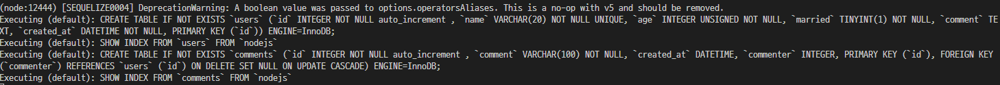

# ✔ MySQL
## ✒ MySQL 설치
#### 🔸 윈도우 설치
- https://www.mysql.com/downloads/
- Choosing a Setup Type 에서 Custom 선택
- Select Products and Features 에서 Server와 Workbench 설치
- 계속 next 누르다가 Authentication Method 에서 Use Legacy Authentication Method 선택해 MySQL 5.x 버전 호화 선택
- `C:\Program Files\MySQL\MySQL Server 8.0\bin` 위치에서 `$ mysql -h localhost -u root -p` 입력
- Enter password: [패스워드 입력]
- mysql> exit => 나가기

#### 🔸 MAC 설치
- Homebrew를 통해 설치
<pre>
$ brew install mysql
$ brew services start mysql
$ mysql_secure_installation
</pre>
- mysql 실행
<pre>
$ mysql.server start
$ mysql -u root -p
Enter password: 
</pre>

## ✒ 데이터베이스 및 테이블 생성
- 프롬프트에 접속 후 `CREATE SCHEMA [데이터베이스명]`이 데이터베이스를 생성한다.
- MySQL에서는 데이터베이스와 Schema는 같은 개념이다.
<pre>
CREATE SCHEMA [데이터베이스명];
use [데이터베이스명];
</pre>
#### 🔸 테이블 생성
<pre>
mysql> CREATE TABLE nodejs.users(
    -> id INT NOT NULL AUTO_INCREMENT,
    -> name VARCHAR(20) NOT NULL,
    -> age INT UNSIGNED NOT NULL,
    -> married TINYINT NOT NULL,
    -> comment TEXT NULL,
    -> created_at DATETIME NOT NULL DEFAULT now(),
    -> PRIMARY KEY(id),
    -> UNIQUE INDEX name_UNIQUE (name ASC))
    -> COMMENT = '사용자 정보'
    -> DEFAULT CHARSET=utf8
    -> ENGINE=InnoDB;
Query OK, 0 rows affected, 1 warning (0.03 sec)
</pre>
- 컬럼 자료형에는 `INT`(정수), `VARCHAR`(가변 길이) , `CHAR`(고정 길이), `TEXT`(긴 글), `TINYINT`(-127~128까지의 정수), `DATETIME`(날짜와 시간)
- `NULL`과 `NOT NULL`은 빈칸을 허용할지를 나타낸다.
- `AUTO_INCREMENT`는 숫자를 저절로 올리겠다는 뜻으로 1,2,3... 카운트가 올라간다.
- `UNSIGNED`는 숫자 자료형에 적용되는 옵션으로 숫자의 범위에서 음수는 무시된다.
- `ZEROFILL`은 숫자의 자릿수가 고정되어 있을 때 사용하는 것이다. (예를 들어 INT(4)일때 숫자 1을 넣는다면 0001이 된다.)
- `now()`는 현재 시간을 넣으라는 뜻이고 `now()`대신 `CURRENT_TIMESTAMP`를 적어도 된다.
- `PRIMARY KEY`는 기본키이다.
- `UNIQUE INDEX`는 해당 값이 고유해야 하는지에 대한 옵션이다.
#### 🔸 데이블 자체에 대한 설정
- `COMMENT`는 테이블에 대한 보충 설명으로 코멘트를 다는 역할이다.
- `DEFAULT CHARSET`을 utf8로 설정하지 않으면 한글이 입력되지 않으니 설정을 한다.
- `ENGINE`은 `MyISAM`과 `InnoDB`가 많이 사용된다.

#### 🔸 테이블 확인
<pre>
DESC users;
</pre>

#### 🔸 테이블 삭제
<pre>
DROP TABLE users;
</pre>

#### 🔸 댓글을 저장하는 테이블
<pre>
mysql> CREATE TABLE nodejs.comments(
    -> id INT NOT NULL AUTO_INCREMENT,
    -> commenter INT NOT NULL,
    -> comment VARCHAR(100) NOT NULL,
    -> created_at DATETIME NOT NULL DEFAULT now(),
    -> PRIMARY KEY(id),
    -> INDEX commenter_idx (commenter ASC),
    -> CONSTRAINT commenter
    -> FOREIGN KEY (commenter)
    -> REFERENCES nodejs.users (id)
    -> ON DELETE CASCADE
    -> ON UPDATE CASCADE)
    -> COMMENT = '댓글'
    -> DEFAULT CHARSET=utf8
    -> ENGINE=InnoDB;
Query OK, 0 rows affected, 1 warning (0.03 sec)
</pre>
- 외래키는 `CONSTRAINT [제악조건명] FOREIGN KEY [컬럼명] REFERENCES [참고하는 컬러명]`이다.
- `CASCADE`는 참조되는 외래키가 같이 삭제된다.

## ✒ 시퀄라이즈 사용하기
- 노드에서 MySQL 데이터베이스에 접속한다.
- MySQL 작업을 쉽게 할 수 있도록 도와주는 라이브러리가 *Sequelize*이다.
- 시퀄라이즈는 ORM(Object-relational Mapping)으로 분류되는데 ORM은 자바스크립트 객체와 데이터베이스의 릴레이션을 매핑해주는 도구이다.
- 시퀄라이즈는 자바스크립트 구문을 알아서 SQL로 바꿔줌으로써 SQL 언어를 직접 사용하지 않아도 자바스크립트만으로 MySQL을 조작할 수 있다.
- 프로젝트를 설치하고 시퀄라이즈를 설치한다.
<pre>
$ express [프로젝트명] --view=pug
// npm 패키지 설치
$ npm i
// sequelize와 mysql2 패키지를 설치한다.
$ npm i sequelize mysql2
// sequelize 커맨드를 사용하기 위해 sequelize-cli를 전역으로 설치한다.
$ npm i -g sequelize-cli
// 설치 완료 후 sequelize init 명령어 호출
$ sequelize init
</pre>
- config, models, migrations, seeders 폴더 생성 확인.
- models/index.js 수정

### 📌 MySQL 연결하기
- 시퀄라이즈를 통해 익스프레스 앱과 MySQL을 연결한다. (app.js 수정)
<pre>
...
var indexRouter = require('./routes/index');
var usersRouter = require('./routes/users');
<b>var sequelize = require('./models').sequelize;</b>

var app = express();
// sync 메서드를 사용하면 서버 실행 시 알아서 MySQL과 연동된다.
<b>sequelize.sync();</b>
...
</pre>

### 📌 모델 정의하기
- 테이블을 시퀄라이즈에서 정의한다.
#### 🔸 models/user.js
- `sequelize.define` 메서드는 테이블명과 각 칼럼의 스펙을 입럭하고 MySQL 테이블과 칼럼 내용이 일치해야 정확하게 대응된다.
- 시퀄라이즈 자료형은 VARCHAR => STRING, INT => INTEGER, TINYINT => BOOLEAN, DATETIME => DATE 로 적는다.
- `allowNull`은 `NOT NULL` 옵션과 동일하다.
- `defaultValue`는 기본값을 의미한다.
- `sequelize.define`의 세 번째 인자는 테이블 옵션으로 `timestamps` 속성이 true이면 시퀄라이즈는 `createdAt`과 `updatedAt` 컬럼을 추가한다.
- 로우가 생성될 떄와 수정될 떄의 시간이 자동으로 입력된다.
- 시퀄라이즈 자체에서 관계를 따로 정의할 수 있다.
#### 🔸 models/index.js
- models/index.js와 연결한다.
<pre>
...
db.User = require("./user")(sequelize, Sequelize);
db.Comment = require("./comment")(sequelize, Sequelize);
...
</pre>

#### 🔸 config/config.json 수정
- `operatorsAliases`는 보안에 취약한 연산자를 사용할지 여부를 설정하는 옵션이다.
- 이 설정은 `process.env.NODE_ENV`가 `development`일 떄 적용된다.
- 나중에 배포할 때는 `production`으로 설정하고, 배포 환경을 위해 데이터베이스 설정할 때는 `production`속성을 수정해준다.
<pre>
  "development": {
    "username": "root",
    <b>"password": "[비밀번호]",</b>
    <b>"database": "nodejs",</b>
    "host": "127.0.0.1",
    "dialect": "mysql",
    "operatorsAliases": false
  },
</pre>

### 📌 관계 정의하기
#### 🔸 1:N 관계
- 시퀄라이즈에서는  1:N 관계를 `hasMany`라는 메서드로 표현한다.
- 예를 들어 users 테이블의 로우 하나를 불러올 때 연결된 comments 테이블의 로우들도 같이 불러올 수 있다.
- 반대로 `belongsTo` 메서드는 comments에서 users테이블의 로우를 가져온다.
- model/index.js에 추가한다.
<pre>
db.User.hasMany(db.Comment, {foreignKey : 'commenter', sourceKey : 'id'});
db.Comment.belongsTo(db.User, {foreignKey : 'commenter', targetKey : 'id'});
</pre>
- `npm start`를 하면 서버를 시작하고 콘솔에 시퀄라이즈가 스스로 SQL문을 실행한다.

#### 🔸 1:1 관계
- 1:1 관계에서는 `hasOne` 메서드를 사용한다.
- `belongsTo` 와 `hasOne`이랑 변경되도 상관없다.
<pre>
db.User.hasOne(db.Comment, {foreignKey : 'commenter', sourceKey : 'id'});
db.Info.belongsTo(db.User, {foreignKey : 'commenter', targetKey : 'id'});
</pre>

#### 🔸 N:M 관계
- N:M 관계는 `belongsToMany` 메서드를 사용한다.
<pre>
db.Post.belongsToMany(db.Comment, {through: 'PostHashtag'});
db.Hashtag.belongsToMany(db.User, {through: 'PostHashtag'});
</pre>
- N:M 관계는 새로운 모델이 생성되고 through 속성에 그 이름을 적어준다.
- N:M 관계 조회를 편하게 할 수 있도록 아래 메서드를 지원한다.
<pre>
// async/await 방식
async(req, res, next) => {
  const tag = await Hashtag.findOne({where : {title: '노드'}});
  const posts = await tag.getPosts();
}

// 프로미스 방식
Hashtag.findOne({where : {title : '노드'}})
  .then(tag => tag.getPosts())
  .then(posts => console.log(posts));

// N:M 관계 추가
async(req, res, next) => {
  const tag = await Hashtag.findOne({where : {title: '노드'}});
  await tag.addPosts(3)
}
</pre>

### 📌 쿼리 설정하기
#### 🔸 INSERT INTO
- `create`메서드를 사용한다.
- MySQL 자료형이 아니라 시퀄라이즈 모델에 정의한 자료형대로 넣어야한다. (married : false)
<pre>
const {User} = require('../models')
User.create({
  name: 'sa',
  age: 26,
  married: false,
  comment:'승민',
});
</pre>
#### 🔸 SELECT FROM
- `SELECT * FROM users;`
<pre>
User.findAll({});
</pre>
- `SELECT * FROM users LIMIT 1;`
<pre>
User.findOne({});
</pre>
- `SELECT name,age  FROM users;`
- `attributes` 속성으로 원하는 컬럼만 가져올 수 있다.
- `order` 속성으로 정렬을 수행할 수 있는데 주의 사항은 배열안에 배열로 이루어져있다. (두개 이상의 칼럼이 가능하기 때문에) 
- `limit` 속성은 `findOne`을 해도되지만 `findeAll`을 하고 `limit`로 설정할 수 있다.
- `offset` 설정도 가능하다.
<pre>
User.findAll({
  attributes:['name','age'],
  order:[['age','DESC']],
  limit: 1,
  offset : 1,
})
</pre>

- `SELECT name,age  FROM users WHERE married = 1 AND age > 30;`
- `where`에 `age`부분은 시퀄라이즈는 자바스크립트 객체를 사용해서 쿼리를 생성해야 하므로 `0p.gt` 같은 특수한 연산자들이 사용된다.
- ES2015 문법으로 `0p.gt`(초과), `0p.gte`(이상), `0p.lt`(미만), `0p.lte`(이하), `0p.ne`(같지 않음), `0p.or`(또는), `0p.in`(배열 요소 중 하나), `0p.notIn`(배열 요소와 모두 다름) 등이 있다.
<pre>
const {User, Sequelize:{0p}} = require('../models');
User.findAll({
  attributes:['name','age'],
  where : {
    married : 1,
    age : {[0p.gt] : 30},
  }
})
</pre>

#### 🔸 UPDATE SET
<pre>
User.update({
  comment: '내용 수정',
},{
  where:{id:2},
})
</pre>

#### 🔸 DELETE FROM
<pre>
User.destory({
  where:{id : 2},
});
</pre>

### 📌 쿼리 수행(CRUD)
- 소스코드 참고

## ✒ 참고 자료
- MySQL 메뉴얼 : https://dev.mysql.com/doc/refman/8.0/en/
- 시퀄라이즈 문서 : https://sequelize.org/v5/

