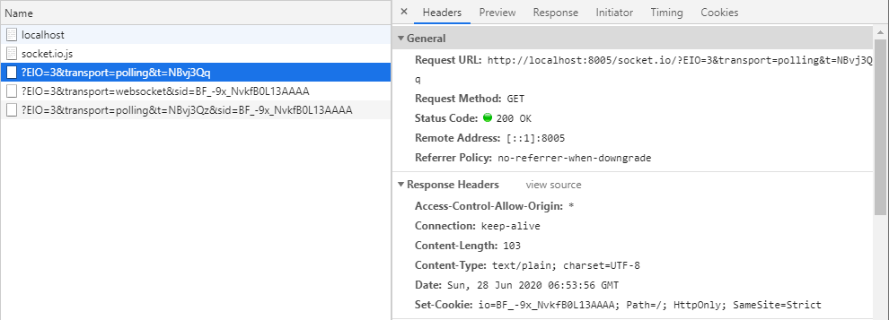
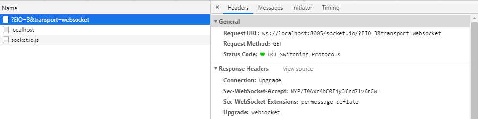
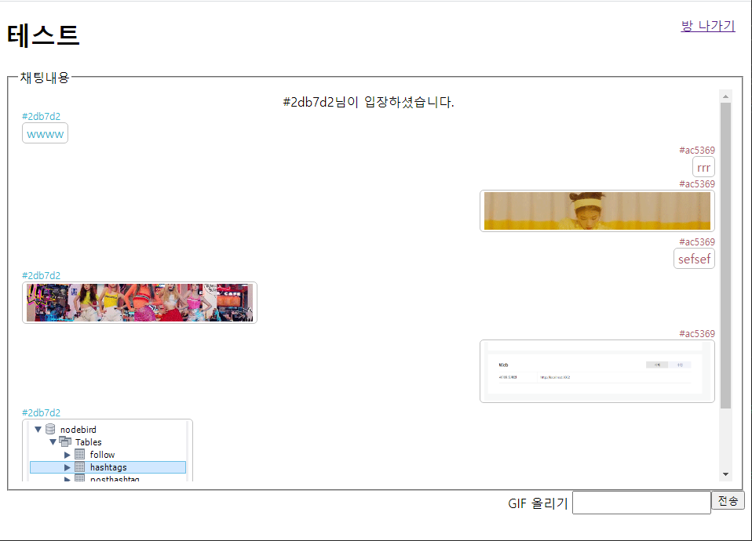

# ✔ Web Socket 으로 실시간 데이터 전송
### 📌 참고 문서
> - 웹 소켓 설명 : https://ko.wikipedia.org/wiki/%EC%9B%B9%EC%86%8C%EC%BC%93
> - WS 공식 문서 : https://www.npmjs.com/package/ws
> - Socket.IO 공식 문서 : https://socket.io/
> - color-hash 공식 문서 : https://www.npmjs.com/package/color-hash
> - proxy-addr 공식 문서 : https://www.npmjs.com/package/proxy-addr
## 🌈 웹 소켓이란?
- HTML5에서 새로 추가된 스펙으로 실시간 양방향 데이터 전송을 위한 기술
- WS라는 프로토콜을 사용하여 브라우저와 서버가 WS 프로토콜을 지원하면 사용할 수 있다.
- 웹 소켓이 나오기 이전에는 HTTP 기술을 사용하여 실시간 데이터 전송을 구현하였다. (**폴링(polling)** 방식)
- 폴링 방식은 HTTP가 클라이언트에서 서버로 향하는 단방향 통신이므로 주기적으로 서버에 새로운 업데이트가 없는지 확인하는 요청을 보내, 있다면 새로운 내용을 가져오는 단순 무식한 방법이다.
- 웹 소켓 연결이 이루어지고 나면 그 다음부터는 계속 연결된 상태로 있어 따로 업데이트가 있는지 요청을 보낸 필요가 없다.
- 또한 HTTP 프로토콜과 포트를 공유할 수 있으므로 다른 포트에 연결할 필요도 없다.
> - 참고로 **서버센트 이벤트(Server Sent Events, 이하 SSE)** 라는 기술도 등장.
> - `EventSource`라는 객체를 사용하여 처음에 한 번만 연결하면 서버가 클라이언트에 지속적으로 데이터를 보내준다.
> - 웹 소켓과 다른 점은 클라이언트에서 서버로는 데이터를 보낼 수 없다는 점으로 서버에서 클라이언트로 데이터를 보내는 단방향 통신이다.
> - 하지만 예를 들어 주식 차트 업데이트나 SNS에서 새로운 게시물 가져오기 등 굳이 양방향 통신을 할 필요가 없는 경우에 서버에서 일방적으로 데이터를 내려줄 때 사용한다.
- `Socket.io`는 웹 소켓을 편리하게 사용할 수 있게 도와주는 라이브러리이다.

## 🌈 ws 모듈로 웹 소켓 사용
1. `npm init` 후 `npm i`
<pre>
  "dependencies": {
    "connect-flash": "^0.1.1",
    "cookie-parser": "^1.4.5",
    "dotenv": "^8.2.0",
    "express": "^4.17.1",
    "express-session": "^1.17.1",
    "morgan": "^1.10.0",
    "pug": "^3.0.0",
    "socket.io": "^2.3.0",
    "ws": "^7.3.0"
  },
  "devDependencies": {
    "nodemon": "^2.0.4"
  }
</pre>
2. `.env`에 `COOKIE_SECRET=[쿠키 비밀키]` 작성
3. `app.js`작성 ([주석 참고](https://github.com/saseungmin/Node.js-tutorial/blob/master/gif-chat/app.js))
4. `routes/index.js` 작성
5. `ws` 모듈을 설치하여 노드에 웹 소켓 구현
<pre>
$ npm i ws
</pre>
6. `app.js`에 웹 소켓을 익스프레스 서버에 연결하는 부분 작성
7. 웹 소켓 로직이 들어있은 `socket.js` 작성 ([주석 참고](https://github.com/saseungmin/Node.js-tutorial/blob/master/gif-chat/socket.js))
8. 양방향 통신이기 때문에 script 부분에 웹소켓 `views/index.pug` 작성 (클라이언트 부분, [주석 참고](https://github.com/saseungmin/Node.js-tutorial/tree/master/gif-chat/views))

## 🌈 Socket.IO 사용
- 구현하고자 하는 서비스가 복잡해지면 Socket.IO를 사용하는 것이 편하다.
<pre>
$ npm i socket.io
</pre>
1. `socketio.js` 작성([주석 확인](https://github.com/saseungmin/Node.js-tutorial/blob/master/gif-chat/socketio.js))
2. `index.pug` 수정([주석 확인](https://github.com/saseungmin/Node.js-tutorial/tree/master/gif-chat/views))
- Socket.IO는 기본적으로 먼저 **폴링 방식으로 서버와 연결**한다.
- 그렇기 때문에 코드에서 HTTP 프로토콜을 사용한 것이다.

- 폴링 연결 후, 웹 소켓을 사용할 수 있다면 웹 소켓으로 업그레이드 한다.
- 웹 소켓을 지원하지 않는 브라우저는 폴링 방식으로, 웹 소켓을 지원하는 브라우저는 웹 소켓 방식으로 사용 가능한 것이다.
- 처음부터 웹 소켓만을 사용하고 싶을 땐, 클라이언트에서 옵션을 수정해준다.
<pre>
var socket = io.connect('http://localhost:8005',{
    // 서버의 path 옵션과 동일해야 한다.
    path:'/socket.io',
    <b>transports:['websocket']</b>
});
</pre>

## 🌈 실시간 GIF 채팅방 만들기
- 몽고디비와 몽고디비 ODM인 몽구스 사용
- 이미지를 업로드하고 서버에 HTTP 요청을 할 것임으로 `multer`와 `axios` 설치
- `color-hash` 모듈은 랜덤 색상을 구현해주는 모듈이다.
<pre>
$ npm i mongoose multer axios color-hash
</pre>
- 스키마 생성 (`schemas/`)
- 채팅창과 메임 화면 채팅방 등록 화면 생성 (`views/`) (주석 참고)
- 서버의 `chatsocket.js`에 웹 소켓 이벤트 연결 (주석 참고)
<pre>
  chat.on('connection', (socket) => {
    console.log('chat 네임스페이스에 접속');
    <b>const req = socket.request;
    const {
      headers: { referer },
    } = req;</b>
    const <b>roomId</b> = referer
      .split('/')
      [referer.split('/').length - 1].replace(/\?.+/, '');
    // 방에 들어올때
    socket.join(<b>roomId</b>);
    socket.on('disconnect', () => {
      console.log('chat 네임스페이스 접속 해제');
      // 방에서 나갈때
      socket.leave(<b>roomId</b>);
    });
  });
</pre>
- Socket.IO에는 네임스페이스보다 더 세부적인 개변으로 방(room)이라는 것이 존재한다.
- 같은 네임스페이스 안에서도 같은 방에 들어 있는 소켓끼리만 데이터를 주고받을 수 있다.
- `join` 메서드와 `leave` 메서드는 방의 아이디를 인자로 받는다.
- `socket.request.headers.referer`를 통해 현재 웹 페이지의 URL을 가져올 수 있고, **URL에서 방 아이디 부분**을 추출한다.
- 접속한 사용자에게 세션 아이디(`req.sessionID`)를 이용하여 `color-hash`패키지로 랜덤 색상으로 고유한 색상을 부여한다.
- `color-hash` 패키지는 세션 아이디를 HEX 형식의 색상 문자열로 바꿔주는 패키지이다. 또한, 해시이므로 같은 세션 아이디는 항상 같은 색상 문자열로 바뀐다.
- 다만, 사용자가 많아질 경우에는 색상이 중복되는 문제가 있을 수 있다.
<pre>
// colorHash를 이용하여 session.color에 Hex값 부여하여 사용자 아이디처럼 사용한다.
app.use((req, res, next) => {
  // session.color가 존재하지 않으면
  if(!req.session.color){
    const colorHash = new ColorHash();
    <b>req.session.color = colorHash.hex(req.sessionID);</b>
  }
  next();
})
</pre>
- 하지만 Socket.IO에서 세션에 졉근할려면 추가 작업이 필요하다.
- Socket.IO도 미들웨어를 통해 `express-session`을 공유한다.
<pre>
const <b>sessionMiddleware</b> = session({
  resave: false, // 재저장을 계속 할 것인지
  saveUninitialized: false, // 세션이 세션store에 저장되기전 Uninitialized 된 상태로 만들어서 저장을 안 시킨다.
  secret: process.env.COOKIE_SECRET, // 비밀키 저장
  // 세션과 쿠키 함께 사용
  cookie: {
    httpOnly: true,
    secure: false,
  },
});
// ...
webSocket(server, app, <b>sessionMiddleware</b>);
</pre>
- `chatsocket.js`에 미들웨어 장착 ([주석 참고](https://github.com/saseungmin/Node.js-tutorial/blob/master/gif-chat/chatsocket.js)) 
- `routes/index.js` 라우터 작성 ([주석](https://github.com/saseungmin/Node.js-tutorial/blob/master/gif-chat/routes/index.js))
<pre>
  // io객체 req.app.get('io')으로 접근 가능
  const io = req.app.get('io');
  // main.pug에 newRoom socket.io
  // /room 네임스페이스에 연결한 모든 클라이언트에게 데이터를 보내는 메서드이다.
  io.of('/room').emit('newRoom', newRoom);
</pre>
- `io.of('/chat').adapter.rooms`에 방 목록이 들어 있다.
- `io.of('/chat').adapter.rooms[req.params.id]`를 하면 해당 방의 소켓 목록이 나온다.
<pre>
  const { rooms } = io.of('/chat').adapter;
  rooms[req.params.id]
</pre>
## 🌈 채팅 구현
- 프런트(`views/chat.pug`)에서는 서버에서 보내는 채팅 데이터를 받을 소켓 이벤트 리스너 생성(chat 이벤트 리스너 추가)
- `routes/index.js`에 채팅하는 부분 추가
- `req.app.get('io').of('/chat').to(방 아이디).emit` 으로 같은 방에 들어 있는 소켓들에게 메시지 데이터를 전송
<pre>
  const chat = new Chat({
    room: req.params.id,
    user: req.session.color,
    chat: req.body.chat,
  });
  // 채팅 mongoDB에 저장
  await chat.save();
  req.app.get('io').of('/chat').to(req.params.id).emit('chat', chat);
  res.send('ok');
</pre>

### 📌 기타 Socket.IO API
- 특정인에게 메시지 보내기
<pre>
socket.io(소켓 아이디).emit(이벤트, 데이터);
</pre>
- 나를 제외한 전체에게 메시지 보내기
<pre>
socket.broadcast.emit(이벤트, 데이터);
// 특정 방 안에서 나를 제외한 나머지에게 매시지 보내기
socket.broadcast.to(방 아이디).emit(이벤트, 데이터);
</pre>

## 🌈 GIF 이미지 전송하기
- 프런트 화면에 이미지를 선택했을 때 업로드하는 이벤트 리스너 추가(`view/chat.pug`)
<pre>
xhr.open('POST', <b>'/room/#{room._id}/gif'</b>);
</pre>
- 위 주소에 상응하는 라우터를 작성한다. (`routes/index.js` [주석 참고](https://github.com/saseungmin/Node.js-tutorial/blob/master/gif-chat/routes/index.js))
- 파일이 업로드된 후에 내용을 저장하고, 방의 모든 소켓에게 채팅 데이터 전달.
<pre>
// upload 변수는 single, array, fields, none 등의 메서드를 가지고 있다.
// single 하나의 이미지를 업로드할 때 사용한다.
// array, fields는 여러 개의 이미지를 업로드할 때 사용한다.
router.post('/room/:id/gif', upload.single('gif'), async (req, res, next) => {
  try {
    const chat = new Chat({
      room: req.params.id,
      user: req.session.color,
      gif: req.file.filename,
    });
    await chat.save();
    // io의 chat 네임스페이스에 해당 채팅룸에 'chat'으로 보낸다.
    req.app.get('io').of('/chat').to(req.params.id).emit('chat', chat);
    res.send();
  } catch (error) {
    console.error(error);
    next(error);
  }
});
</pre>

- 이미지를 제공할 `uploads` 폴더를 `express.static` 미들웨어로 연결한다. (`app.js`)
<pre>
app.use('/gif', express.static(path.join(__dirname,'uploads')));
</pre>

- 실행결과

### 📌 추가 작업하기
- 채팅방에 현재 참여자 수나 목록 표시하기
- 시스템 메시지까지 DB에 저장하기
- 채팅방에서 한 사람에게 귓속말 보내기 (socket.io(소켓 아이디))
- 방장 기능 구현(방에 방장 정보를 저장한 후 방장이 나갔을 때 방장 위임 기능)
- 강퇴 기능 구현하기
