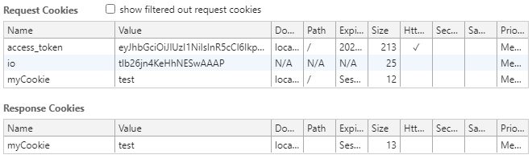
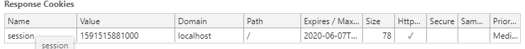

# ✔️ http 모듈로 웹 서버 만들기
### 📌 참고
> - 쿠키 설명 : https://developer.mozilla.org/ko/docs/Web/HTTP/Cookies
> - 세션 설명 : https://developer.mozilla.org/ko/docs/Web/HTTP/Session
> - https 모듈 설명 : https://nodejs.org/dist/latest-v12.x/docs/api/https.html
> - http2 모듈 설명 : https://nodejs.org/dist/latest-v12.x/docs/api/http2.html
> - Cluster 모듈 설명 : https://nodejs.org/dist/latest-v12.x/docs/api/cluster.html
## ✒ 요청과 응답
- 이벤트 리스너를 가진 노드 서버 만들기
- req 객체는 요청에 관한 정보들과 res 객체는 응답에 관한 정보를 담는다.
<pre>
// 콜백 함수로 넣어준다.
const http = require('http');

http.createServer((req, res) => {
    res.write('< h1>hello< /h1>');
    res.end('< p>hello world< /p>')
}).listen(8080, () => {
    console.log('8080연결 대기');
})
</pre>
> 📌 자세한 방법은 [server1.js](https://github.com/saseungmin/Node.js-tutorial/blob/master/http%20%EB%AA%A8%EB%93%88%EB%A1%9C%20%EC%9B%B9%20%EC%84%9C%EB%B2%84%20%EB%A7%8C%EB%93%A4%EA%B8%B0/%EC%9A%94%EC%B2%AD%EA%B3%BC%20%EC%9D%91%EB%8B%B5/server1.js)  참고
- 파일을 읽어와서 html 파일을 전송하는 방법은 `fs.readFile()`을 사용해서 처리한다.
> 📌 자세한 방법은 [server2.js](https://github.com/saseungmin/Node.js-tutorial/blob/master/http%20%EB%AA%A8%EB%93%88%EB%A1%9C%20%EC%9B%B9%20%EC%84%9C%EB%B2%84%20%EB%A7%8C%EB%93%A4%EA%B8%B0/%EC%9A%94%EC%B2%AD%EA%B3%BC%20%EC%9D%91%EB%8B%B5/server2.js)와 [server2.html](https://github.com/saseungmin/Node.js-tutorial/blob/master/http%20%EB%AA%A8%EB%93%88%EB%A1%9C%20%EC%9B%B9%20%EC%84%9C%EB%B2%84%20%EB%A7%8C%EB%93%A4%EA%B8%B0/%EC%9A%94%EC%B2%AD%EA%B3%BC%20%EC%9D%91%EB%8B%B5/server2.html) 참고
<pre>
    fs.readFile('./server2.html', (err, data) => {
        if(err){
            throw err;
        }
        res.end(data);
    });
</pre>

## ✒ 쿠키와 세션
- 쿠키는 name=seung;year=2010 처럼 문자열 형식으로 오므로 이를  {name : 'seung', year:'2020'}와 같이 객체로 바꾸는 함수가 필요하다.
- server3.js `parseCookies`참조
- 쿠키는 `req.headers.cookie`에 담겨있다.
- 응답의 헤더에 쿠키를 기록해야 하므로 `res.writeHead` 메서드를 사용한다
- `res.writeHead`의 첫 번째 인자는 상태 코드를 넣어주고 두 번째 인자에 헤더의 내용을 입력한다.(`"Set-Cookie": "myCookie=test"`)

#### 🔶 쿠키의 옵션
> - 쿠키명=쿠키값 : 기본적인 쿠키의 값이다. name=seung 과 같이 설정할 수 있다.
> - Expires=날짜 : 만료 기한으로써 이 기한이 지나면 쿠키가 제거되고 기본값은 클라이언트가 종료될 때까지이다.
> - Max-age=초 : Expires와 비슷하지만 날짜 대신 초를 입력할 수 있고 해당 초가 지나면 쿠키가 제거된다. 또한, Expires 보다 우선된다.
> - Domain=도메인명 : 쿠키가 전송될 도메인을 특정할 수 있다. 기본값은 현재 도메인이다.
> - Path=URL : 쿠키가 전송될 URL을 특정항 수 있다. 기본값은 '/'이고 이 경우 모든 URL에서 쿠키를 전송할 수 있다.
> - Secure: HTTPS일 경우에만 쿠키가 전송된다.
> - HttpOnly : 설정 시 자바스크립트에서 쿠키에 접근할 수 없다.

- [server4.js](https://github.com/saseungmin/Node.js-tutorial/blob/master/http%20%EB%AA%A8%EB%93%88%EB%A1%9C%20%EC%9B%B9%20%EC%84%9C%EB%B2%84%20%EB%A7%8C%EB%93%A4%EA%B8%B0/%EC%BF%A0%ED%82%A4%EC%99%80%20%EC%84%B8%EC%85%98/server4.js) 에서의 방법은 쿠키가 노출되어 쿠키가 조작될 위험이 있다. => server5.js
> 📌 [server5.js](https://github.com/saseungmin/Node.js-tutorial/blob/master/http%20%EB%AA%A8%EB%93%88%EB%A1%9C%20%EC%9B%B9%20%EC%84%9C%EB%B2%84%20%EB%A7%8C%EB%93%A4%EA%B8%B0/%EC%BF%A0%ED%82%A4%EC%99%80%20%EC%84%B8%EC%85%98/server5.js) 참고(세션 방법)
<pre>
// 임의의 숫자를 보낸다.
// 사용자 이름과 만료시간은 session 객체에 담는다.
const randomInt = Date.now();
session[randomInt] = {
    name,
    expires,
};
res.writeHead(302, {
Location: "/",
"Set-Cookie": `session=${randomInt}; Expires=${expires.toUTCString()}; HttpOnly; Path=/`,
});
res.end();
</pre>

## ✒ REST API(REpresentational State Transfer)와 라우팅
- REST API는 네트워크 구조의 한 형식으로 서버의 자원을 정의하고, 자원에 대한 주소를 지정하는 방법을 가르킨다.
- 주소는 의미를 명확히 전달하기 위해 명사로 구성된다. (사용자 정보 : /user 게시글 : /post)
#### 🔶 HTTP 요청 메서드
> - GET : 서버의 자원을 가져오고자 할 때 사용하는 것으로 요청의 본문에 데이터를 넣지 않고 데이터를 서버로 보내야 한다면 쿼리스트링을 사용한다.
> - POST : 서버에 자원을 새로 등록하고자 할 때 사용하는 것으로 요청의 본문(body)에 새로 등록할 데이터를 넣는다.
> - PUT : 서버의 자원을 요청에 들어 있는 자원으로 치환하고자 할 때 사용하는 것으로 요청의 본문(body)에 치환할 데이터를 넣어 보낸다.
> - PATCH : 서버 자원의 일부만 수정하고자 할 때 사용하는 것으로 요청의 body에 일부 수정할 데이터를 넣어 보낸다.
> - DELETE : 서버의 자원을 삭제하고자 할 때 사용한다.

#### 🔶 Front js 부분
> 📌 [restFront.js](https://github.com/saseungmin/Node.js-tutorial/blob/master/http%20%EB%AA%A8%EB%93%88%EB%A1%9C%20%EC%9B%B9%20%EC%84%9C%EB%B2%84%20%EB%A7%8C%EB%93%A4%EA%B8%B0/REST%20API%EC%99%80%20%EB%9D%BC%EC%9A%B0%ED%8C%85/restFront.js)
<pre>
function getUser() {
  // 로딩 시 사용자가 가져오는 함수
  var xhr = new XMLHttpRequest();
  xhr.onload = function () {
    if (xhr.status === 200) {
      // 받은 users JSON
      var users = JSON.parse(xhr.responseText);
      // 생략..
      // users 객체의 key로 map
      Object.keys(users).map(function (key) {
          //생략..
      }
    }
  }
}
</pre>
- 수정
<pre>
    xhr.open("PUT", "/users/" + key);
    xhr.setRequestHeader("Content-Type", "application/json");
    xhr.send(JSON.stringify({ name: name }));
</pre>
- 삭제
<pre>
    xhr.open("DELETE", "/users/" + key);
    xhr.send();
</pre>
- getList
<pre>
  // 사용자 목록을 가져온다.
  xhr.open("GET", "/users");
  xhr.send();
</pre>
- 등록
<pre>
  xhr.open("POST", "/users");
  xhr.setRequestHeader("Content-Type", "application/json");
  xhr.send(JSON.stringify({ name: name }));
</pre>

#### 🔶 Server js 부분
> 📌 [restServer.js](https://github.com/saseungmin/Node.js-tutorial/blob/master/http%20%EB%AA%A8%EB%93%88%EB%A1%9C%20%EC%9B%B9%20%EC%84%9C%EB%B2%84%20%EB%A7%8C%EB%93%A4%EA%B8%B0/REST%20API%EC%99%80%20%EB%9D%BC%EC%9A%B0%ED%8C%85/restServer.js)
- getList
<pre>
if (req.method === "GET") {
    // 생략..
    else if (req.url === "/users") {
        return res.end(JSON.stringify(users));
    }
}
</pre>
- 등록
<pre>
else if (req.method === "POST") {
      if (req.url === "/users") {
        let body = "";
        req.on("data", (data) => {
          // 받은 데이터들을 body에 넣는다.
          body += data;
        });
        return req.on("end", () => {
          const { name } = JSON.parse(body);
          const id = Date.now();
          users[id] = name;
          // 201 Created 요청 성공, 자원 생성
          res.writeHead(201);
          res.end("등록 성공");
        });
      }
}
</pre>

- 수정
<pre>
else if (req.method === "PUT") {
      // startsWith() 메서드는 어떤 문자열이 특정 문자로 시작하는지 확인하여 결과를 true false로 반환한다.
      if (req.url.startsWith("/users/")) {
        // /기준으로 자른뒤 [2]번째 값 : key 값
        const key = req.url.split("/")[2];
        console.log("PUT key : ", key);
        let body = "";
        req.on("data", (data) => {
          body += data;
        });
        return req.on("end", () => {
          console.log("PUT body : ", body);
          users[key] = JSON.parse(body).name;
          return res.end(JSON.stringify(users));
        });
      }
    }
</pre>
- 삭제
<pre>
else if (req.method === "DELETE") {
      if (req.url.startsWith("/users/")) {
        const key = req.url.split("/")[2];
        delete users[key];
        return res.end(JSON.stringify(users));
      }
    }
</pre>

## ✒ https와 http2
#### 🔶https
-  두 번째 인자는 http모듈과 같이 서버 로직이고, 첫번째 인자는 인증서에 관련된 욥션 객체이다.
<pre>
const https = require("https");
https
  .createServer(
    {
      cert: fs.readFileSync("도메인 인증서 경로"),
      key: fs.readFileSync("도메인 비밀키 경로"),
      ca: [
        fs.readFileSync("상위 인증서 경로"),
        fs.readFileSync("상위 인증서 경로"),
      ],
    },
    (req, res) => {
      //생략..
    }
  )
  .listen(443, () => {
    console.log("443포트 열림");
  });
</pre>
#### 🔶http2
- 최신 HTTP 프로토콜인 http/2를 사용할 수 있다.
- 기존 방식보다 웹의 속도가 많이 개선됬다.
<pre>
const http2 = require("http2");
// 동일
</pre>

## ✒ cluster
- cluster 모듈은 싱글 스레드인 노드가 cpu 코어를 모두 사용할 수 있게 해주는 모듈이다.
- 병렬로 실행된 서버의 개수만큼 요청이 분산되게 할 수 있다.
- 성능이 개선되긴하지만 세션을 공유하지 못하는 등 단점이 존재.(Redis 등의 서버를 도입하여 해결)
<pre>
if (cluster.isMaster) {
  console.log(`마스터 프로세스 아이디: ${process.pid}`);
  // cpu 개수만큼 worker 생산
  for (let i = 0; i < numCPUs; i += 1) {
    cluster.fork();
  }
  // worker 종료
  cluster.on("exit", (worker, code, signal) => {
    console.log(`${worker.process.pid}번 worker 종료`);
  });
</pre>

