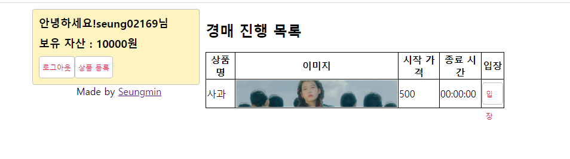
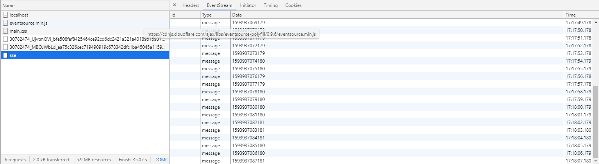
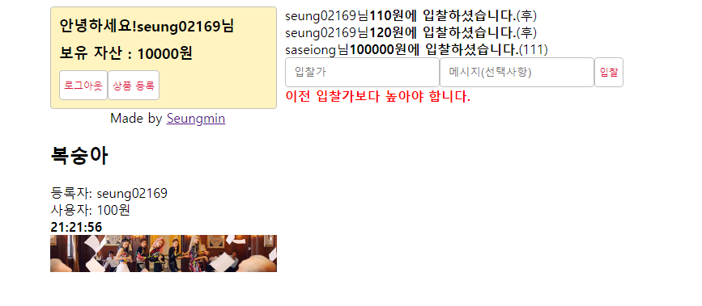

# ✔ 실시간 경매 시스템 만들기
## 🌈 기본 설정
- `package.json` 작성
<pre>
$ npm i connect-flash cookie-parser dotenv express express-session morgan multer pug
// 개발환경에서만 nodemon 사용
$ npm i -D nodemon
// MySQL 사용, 시퀄라이즈를 설치하고, 기본 디렉터리를 만든다.
$ npm i -g sequelize-cli
$ npm i sequelize mysql2
$ sequelize init
</pre>
- 사용자 모델, 제품 모델, 경매 모델로 구성한다. (`user.js`, `good.js`, `auction.js`)
- 모델 생성 후 모델을 데이터베이스 및 서버와 연결한다. (`config/config.json`)
- 데이터베이스 생성
<pre>
$ sequelize db:create
</pre>
- 모델 파일 수정(`models/index.js`)
> - 1대 다 관계가 두 번 적용
> - 사용자가 여러 상품을 등록할 수 있고, 사용자가 여러 상품을 낙찰받을 수도 있다.
> - 둘을 구별하기 위해 as 속성에 owner, sold로 관계명을 적어준다.
> - 각각 ownerId, soldId 컬럼으로 상품 모델에 추가된다.
<pre>
db.Good.belongsTo(db.User, { as: 'owner' });
db.Good.belongsTo(db.User, { as: 'sold' });
// 한 사용자는 입찰을 여러 번 할 수 있다. 1:N
db.User.hasMany(db.Auction);
// 한 상품에 여러명 입찰 가능 1:N
db.Good.hasMany(db.Auction);
db.Auction.belongsTo(db.User);
db.Auction.belongsTo(db.Good);
</pre>

#### 🔸 로그인을 위한 passport 설정하기
<pre>
$ npm i passport passport-local bcrypt
</pre>
- `.env` 파일 설정
<pre>
COOKIE_SECRET=[쿠키 비밀키]
</pre>
- `app.js`
- 이작업을 안하면 `passport.initialize() middleware not in use` 에러가 뜬다.
- [에러 설명](https://velog.io/@cyranocoding/PASSPORT.js-%EB%A1%9C-%EC%86%8C%EC%85%9C-%EB%A1%9C%EA%B7%B8%EC%9D%B8-%EA%B5%AC%ED%98%84%ED%95%98%EA%B8%B0#sessions-optional)
<pre>
app.use(passport.initialize()); // passport 구동
app.use(passport.session()); // 세션 연결
</pre>
#### 🔸 클라이언트 뷰 단 설정하기 (views 폴더)
- views/ 폴더
- `routes/index.js` 작성
- res.locals.user 로 모든 pug 템플릿에 사용자 정보를 변수로 집어 넣는다.
- 이렇게 하면 res.render 메서드에 user:req.user를 하지않아도 되므로 중복제거가 가능하다.
<pre>
router.use((req, res, next) => {
  res.locals.user = req.user;
  next();
});
</pre>

## 🌈 서버센트 이벤트
- 경매는 시간이 중요하기 때문에 서버시간을 받아와야 한다.
- 폴리이나 웹 소켓을 통해서 받아올 수도 있지만, 서버 시간을 조회하는데는 양방향 통신이 필요하지 않아 서버센트 이벤트를 사용해서 사버의 시간을 받아온다.
- 경매 진행 중 다른 사람이 참여하거나 입찰했을 때 모두에게 금액을 알리기 위해서 웹 소켓을 사용.
- `SSE` 패키지와 `Socket.IO` 패키지 설치
<pre>
$ npm i sse socket.io
</pre>
- 서버와 `sse, socket.io` 모듈 연결
<pre>
const server = app.listen(app.get('port'), () => {
  console.log(app.get('port'), '번 포트에서 대기 중');
});

webSocket(server, app);
sse(server);
</pre>

- `SSE` 모듈을 불러와 `new SSE`(익스프레스 서버)로 서버 객체 생성 (`sse.js`)
- 라우터에서 SSE를 사용할려면 `app.set` 메서드로 client 객체를 등록하고, `req.app.get` 메서드로 가져온다.
<pre>
  sse.on('connection', (client) => {
    // 클라이언트와 연결시 어떤 동작을 할지 정의할 수 있다.
    // 1초마다 클라이언트에게 서버 시간 타임스탬프를 보낸다.
    setInterval(() => {
      // 단, 문자열만 보낼 수 있다.
      client.send(Date.now().toString());
    }, 1000);
  });
</pre>
- `Socket.IO`와 연결 (`socket.js`)
#### 📌 서버센트 이벤트의 단점
- `EventSource`라는 객체를 지원하지 않아서 IE나 엣지 브라우저에서 사용할 수 없다.
- `EventSource`를 사용자가 직접 구현하면 사용할 수 있다.
- IE나 엣지 브라우저를 위해 클라이언트 코드에 `EventSource polyfill`을 넣어준다.
<pre>
script(src="https://cdnjs.cloudflare.com/ajax/libs/eventsource-polyfill/0.9.6/eventsource.min.js")
</pre>
- `new EventSource('/sse')`로 서버와 연결하고, `es.onmessage` 또는 `es.addEventListener('message')` 이벤트 리스너로 서버로부터 데이터를 받을 수 있다.
- 서버로 부터 받은 데티어는 **`e.data`** 에 들어있다.
<pre>
var es = new EventSource('/sse');
es.onmessage = function (e) {
}
</pre>
- `eventsource.min.js`는 `EventSource Polyfill` 파일로 GET /sse가 바로 서버센트 이벤트에 접속한 것이다.
- Type이 eventsource로 나와있어 일반 HTTP 연결을 통해 서버센트 이벤트를 사용할 수 있다.
- GET /sse에 EventStream 탭에 매 초마다 서버로부터 현재시간 타임스탬프 데이터가 오는 것을 확인할 수 있다.

#### 📌 경매를 진행하는 페이지 (서버센트 이벤트와 웹 소켓 연결)
- `views/auction.pug`
<pre>
  script(src="https://cdnjs.cloudflare.com/ajax/libs/eventsource-polyfill/0.9.6/eventsource.min.js")
  script(src="/socket.io/socket.io.js")
</pre>

#### 📌 라우터에 GET /good/:id 와 POST /good/:id/bid 추가 
- `routes/index.js` [주석 참고](https://github.com/saseungmin/Node.js-tutorial/blob/master/node-auction/routes/index.js)

