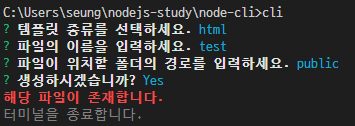

# ✔ CLI(Command Line Interface) 프로그램 만들기
### 📌 참고 문서
> - Process 공식 문서 : https://nodejs.org/dist/latest-v12.x/docs/api/process.html
> - Commander 공식 문서 : https://www.npmjs.com/package/commander
> - Inquirer 공식 문서 : https://www.npmjs.com/package/inquirer
> - Chalk 공식 문서 : https://www.npmjs.com/package/chalk

- *npm*, *nodemon*이나 *express-generator*와 같이 커맨드라인 인터페이스(*Command Line Interface*) 기반으로 동작하는 노드 프로그램들
- CLI는 콘솔 창에 통해서 프로그램을 수행하는 환경을 뜻한다. (반대 GUI)
- ex) 리눅스의 셸이나 브라우저의 콘솔, 명령 프롬프트
## 🌈 간단한 콘솔 명령어 만들기
- `$ npm init`으로 *package.json* 생성하기
- index.js의 첫번째 주석은 리눅스나 맥 같은 유닉스 기반 운영체제에서는 `/usr/bin/env`에 등록된 `node`명령어로 이 파일을 실행하라는 뜻이다.
- 윈도우에서는 단순한 주석으로 취급한다.
<pre>
#! /usr/bin/env node
console.log('Hello CLI');
</pre>
#### index.js를 CLI 프로그램으로 만들기
- *package.json*에 추가
- bin 속성이 콘솔 명령어와 해당 명령어 호출 시 실행 파일을 설정하는 객체이다.
- 콘솔 명령어는 cli, 실행파일은 index.js로 지정
<pre>
  "bin": {
    "cli": "./index.js"
  }
</pre>
- 콘솔에서 현재 패키지를 전역으로 설치
<pre>
$ npm i -g
</pre>
- 콘솔에 `cli`를 입력하면 index.js가 실행된다.
<pre>
$ cli
Hello CLI
</pre>
- 추가 기능 template.js 확인

## 🌈 Commander, Inquirer 사용하기
- npm에는 CLI 프로그램을 위한 라이브러리가 있다.
- 대표적으로 *yargs*, *commander*, *meow* 등이 있다.
- *commander*와 더불어 CLI 프로그램과 사용자 간의 상호작용를 돕는 *Inquirer* 패키지, 콘솔 텍스트에 스타일을 추가하는 *chalk* 패키지도 함께 사용한다.
<pre>
$ npm i commander inquirer chalk
</pre>
- *commander* 패키지로부터 `program` 객체를 불러온다
<pre>
const program = require('commander');
</pre>
#### 🔸 commander의 program 객체의 메서드 종류
- `version` : 프로그램의 버전을 설정할 수 있다. 첫 번째 인자로 버전을 넣어주고, 두번째 인자로 버전을 보여줄 옵션을 넣는다. (`cli -v / cli --version`)
<pre>
program.version('0.0.1', '-v, --version');
=> 0.0.1
</pre>
- `usage`
  - 명령어의 사용법을 설정할 수 있다. 사용법은 명령어에 도움 옵션(-h 또는 --help)을 붙였을 때 나타나는 설명서에 표시된다.
  - 설명서는 commander가 자동으로 생성하고 [option]라고 되었는건 필수가 아닌 선택이라는 뜻으로 옵션을 넣어도 되고 안 넣어도 된다.
<pre>
program.version('0.0.1', '-v, --version')<b>.usage('[options]')</b>;
</pre>
- `command`
  - 명령어를 설정하는 메서드로 `<>`는 필수라는 의미로 값을 넣지 않으면 에러가 발생한다.
  - *는 와일드카드 명령어로 나머지 모든 명령어를 의미한다.
<pre>
// cli template html
program.command('template < type>')
program.command('*')
</pre>
- `description` : 명령어에 대한 설명을 설정하는 메서드로 명령어 설명서에 표시된다.
<pre>
program..description('템플릿을 생성합니다.')
</pre>
- `alias`
  - 명령어의 별칭을 설정할 수 있다.
  - template 명령어의 별칭이 tmpl로 설정할 수 있고 `cli tmpl html`으로 명령어를 실행할 수 있다.
<pre>
program.alias('tmpl')
</pre>
- `option`
  - 명령어에 대한 부가적인 옵션을 설정할 수 있다.
  - 첫 번째 인자가 옵션 명령이고, 두 번째 인자가 옵션에 대한 설명이다.
  - 마지막(세 번째)인자는 옵션의 기본값으로 옵션을 입력하지 않았을 경우 자동으로 기본값이 적용된다.
<pre>
program.option('-n, --name < name>', '파일명을 입력하세요.', 'index')
  .option('-d, --directory [path]', '생성 경로를 입력하세요.', '.')
</pre>
- `action` : 명렁어에 대한 실제 동작을 정의하는 메서드로 <> 같은 필수 요소나 옵션들을 매개변수로 가져올 수 있다.
<pre>
program.action((type, options) => {
    console.log(type, options.name, options.directory);
  });
</pre>
- `help` : 설명서를 보여주는 옵션으로 `-h`나 `--help` 옵션으로 설명서를 볼 수도 있지만, 이 메서드를 사용해 프로그래밍적으로 표시할 수도 있다.
<pre>
program.command('*', { noHelp: true }).action(() => {
  console.log('해당 명령어를 찾을 수 없습니다.');
  <b>program.help()</b>;
});
</pre>
- `parse`: program 객체의 마지막에 붙이는 메서드로 `process.argv`를 인자로 받아서 명령어와 옵션을 파싱한다.
<pre>
program.parse(process.argv);
</pre>

#### 🔸 Inquirer
- `commander`를 사용하더라도 여전히 명령어를 외워야 한다.
- 설명서도 제공하고, 옵션 순서도 바꿀 수 있지만 여전히 불편하다.
- `inquirer`로 `cli` 명령어 사용 시에 사용자와 상호 작용을 편하게 시킬 수 있다.
- `template.js`에서 `readline` 모듈을 사용할 때와 달리 간단하게 적용시킬 수 있다.
<pre>
inquirer
    .prompt([
      {
        type: 'list',
        name: 'type',
        message: '템플릿 종류를 선택하세요.',
        choices: ['html', 'express-router'],
      }
      ...
    ])
    .then((answers) => {
      if (answers.confirm) {
        makeTemplate(answers.type, answers.name, answers.directory);
      }
    });
</pre>
- `inquirer.prompt` 메서드는 인자로 질문 목록을 받고, 프로미스를 통해 답변(`answers`객체)을 반환한다. 아래는 `prompt` 속성들이다.
  - `type`: 질문의 종류로 `input`(일반적인 답변), `checkbox`, `list`(다중 택일), `password`, `confirm`(yes or no) 등이 있다.
  - `name`: 질문의 이름으로 나중에 답변(answers) 객체가 속성명으로 질문의 이름을 속성값으로 질문의 답을 가지게 된다. (`answers.type`)
  - `message`: 사용자게에 표시되는 문자열이다.
  - `choices`: `type`이 `checkbox`, `list` 등인 경우 선택지를 넣는 곳으로 배열로 넣어준다.
  - `defalut`:  답을 적지 않았을 경우 적용되는 기본값이다.

#### 🔸 chalk 패키지
- 터미널에 색과 스타일을 추가한다.
<pre>
const chalk = require('chalk');
console.error(<b>chalk.bold.red</b>('해당 파일이 존재합니다.'));
console.log(<b>chalk.green</b>(pathToFile, '생성 완료'));
console.log(<b>chalk.rgb(128,128,128)</b>('터미널을 종료합니다.'));
</pre>

