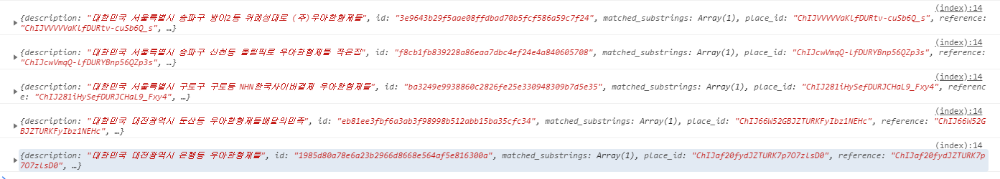
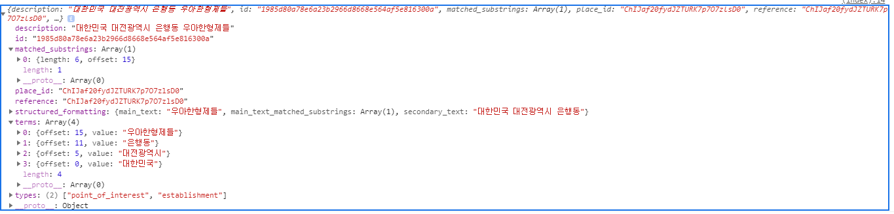
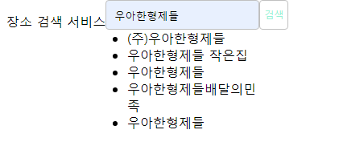
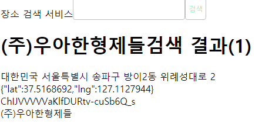
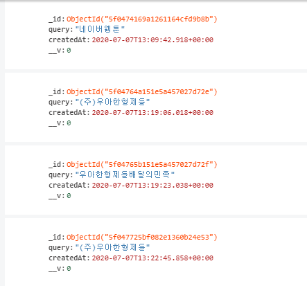
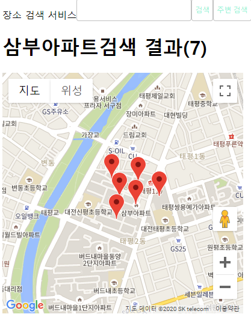
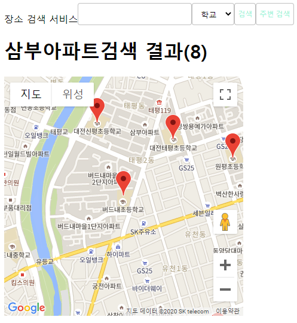
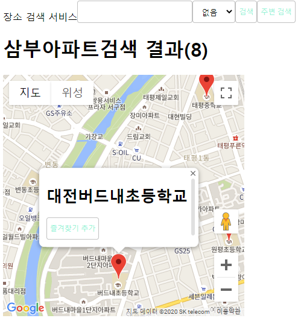

# ✔ 구글 API로 장소 검색 서비스 만들기
### 📌 참고 문서 
> - Google Maps Platform : https://cloud.google.com/maps-platform/
> - Google Maps Platform 시작하기 : https://developers.google.com/maps/gmp-get-started
> - @google/maps 공식 문서 npm : https://www.npmjs.com/package/@googlemaps/google-maps-services-js
> - geolocation MDN : https://developer.mozilla.org/ko/docs/WebAPI/Using_geolocation

## 🌈 기본 설정
- *package.json* 패키지 설치
<pre>
$ npm i
</pre>
- 몽고디비와 몽고디비 ODM인 몽구스 사용
- 즐겨찾기 스키마 생성 (장소아이디(`placeId`), 장소명(`name`), 좌표(`location`), 생성 시간(`createdAt`))
    -  `location` 필드는 좌푤흘 저장하는 필드로, 경도와 위도 정보가 배열로 들어있고, `index`가 `2dsphere`로 되어 있는데, 위치 정보를 저장한다.
- 검색 내역 스키마는 검색어(`query`)와 생성 시간(`createAt`) 스키마로 구성되어 있다.
- 만들 스키마들을 index.js 파일에서 몽고비디와 연결한다.
- app.js를 작성하고, 몽구스를 서버와 연결한다.
- 비밀키를 관리할 `.env` 파일 생성
<pre>
COOKIE_SECRET=[비밀키]
</pre>

## 🌈 Google Places API 사용하기
- 구글 지도와 구글 플러스가 사용하는 장소 데이터베이스에서 데이터를 가져올 수 있다.
- 구글 또는 G-mail 계정이 있어야 사용할 수 있다.
- https://developers.google.com/maps/gmp-get-started#quickstart
- 발급한 키를 `.env`파일에 저장한다.
<pre>
PLACES_API_KEY=[API key]
</pre>
- 구글은 노드를 위한 API 모듈을 제공한다.
<pre>
$ npm i @google/maps
</pre>

#### 🔸 라우터 생성(routes/index.js)
-  @google/maps 패키지로부터 구글 지도 클라이언트를 만드는 방법
<pre>
const googleMapsClient = <b>googleMaps.createClient</b>({
  key: process.env.PLACES_API_KEY,
});
</pre>
- 구글 지도 클라이언트의 `placesQueryAutoComplete` API는 검색어 자동완성이다.
- 전달된 쿼리를 input에다가 넣어준다.
- 콜백 방식으로 동작하고, 결과는 `response.json.predictions`에 담겨있다.
- 예상 검색어는 최대 다섯 개까지 반환된다.
<pre>
  googleMapsClient.<b>placesQueryAutoComplete</b>(
    {
      input: req.params.query,
      language: 'ko',
    },
    (err, response) => {
      if (err) {
        return next(err);
      }
      return res.json(response.json.predictions);
    },
  );
</pre>
- 실제 장소 검색 시 결괏값을 반환한다.
- `response.json.results` 에 결과가 담겨있다.
<pre>
const googlePlaces = util.promisify(<b>googleMapsClient.places</b>);
const response = await googlePlaces({
    query: req.params.query,
    language: 'ko',
});
</pre>
- `util.promisify`를 사용한 이유는 구글 지도 클라이언트는 콜백 방식으로 동작하는데, 몽구스 프로미스와 같이 사용하기 위해 프로미스 패턴으로 바꾸어주었다.
- 이렇게 바꿀 수 있는 콜백들은 프로미스로 배꿔서 최종적으로 `async/await` 문법을 사용한다.

#### 🔸 서비스 프런트 화면 부분 (views)
- `layout.js` 중요 로직
- API 데이터 연관 검색어 결과

<pre>
predictions.forEach(function (pred) {
    console.log(pred);
    var li = document.createElement('li');
    li.textContent = pred.terms[0].value; // 연관검색어 이름
    li.onclick = function () {
    // 클릭시 href로 해당 이름으로 보낸다.
    location.href = '/search/' + pred.terms[0].value;
    };
    ul.appendChild(li);
});
</pre>

- 연관검색어

- 검색 결과

- 검색결과 mongoDB 저장

## 🌈 Google Maps API 사용하기
- `views/result.pug` 수정
- 검색 결과 렌더링
<pre>
script.
    var positions = [];
for result in results
    script.
        positions.push({
            lat: #{result.geometry.location.lat},
            lng: #{result.geometry.location.lng},
            name: '#{result.name}',
            id: '#{result.place_id}',
        });
</pre>
- `initMap` 함수가 호출되면 `new google.maps.Map(태그, 옵션)`으로 지도를 렌더링한다.
- `new google.maps.Marker(옵션)`로 지도에 마커를 표시한다.
<pre>
script.
    function initMap(){
        var center = positions[0] || {lat: 37.540705, lng: 126.956764};
        var map = new google.maps.Map(document.getElementById('map'),{
            zoom:15, // 확대 정도
            center:center // 지도의 중심 좌표
        });
        positions.forEach(function(pos) {
            new google.maps.Marker({
                position:{lat: pos.lat, lng: pos.lng}, // 위도와 경도
                map:map, // 마커를 표시할 지도를 가리킨다.
                title:pos.name // 마우스를 올렸을때 툴팁 메시지 설정
            });
        });
    }
</pre>
- 구글 지도 관련 스크립트를 불러오는 태그
<pre>
  script(async defer src="https://maps.googleapis.com/maps/api/js?key=[자신 키]&callback=initMap")
</pre>

## 🌈 위치 기반 검색 수행하기
- 정확도를 높이기 위해 내 위치 주변을 검색하는 API와 특정 종류의 장소(카페, 병원등)만 검색하는 API를 만든다.
- 프런트엔드에서 나의 위치를 확인하는 방법 (`layout.pug`)
<pre>
navigator.geolocation.getCurrentPosition(function (position){
// ...
},function(){
  alert('내 위치 확인 권한을 허용하세요.');
},{
  enableHighAccuracy:false,
  maximumAge:0,
  timeout:Infinity
});
</pre>
- 쿼리스트링으로 `lat`과 `lng`이 제공되면 *places API* 대신에 *placesNearBy API*를 사용한다. (`routes/index.js`)
- `keyword` 옵션은 찾을 검색어, `location`은 위도와 경도, `rankby`는 정렬 순서, `language`는 검색 언어를 의미한다.
- `radius`는 인기순으로 정렬하고 싶을 때 검색 반경을 입력하는 용도이다.
- `rankby` 대신 `radius`를 입력하면 반경 내 장소들을 인기순으로 검색한다.
<pre>
const googlePlacesNearby = util.promisify(googleMapsClient.placesNearby);
...
// 위도와 경도가 존재하면
if (lat && lng) {
  response = await googlePlacesNearby({
    keyword: req.params.query,
    location: `${lat},${lng}`,
    rankby: 'distance',
    language: 'ko',
  });
}
</pre>
- npm start 뒤 위치 권한을 수락한 후 검색 결과

### ✒ 장소의 종류 지정하기
- places와 placesNear API의 옵션으로 type을 줄 수 있다.
- [type 목록](https://developers.google.com/places/web-service/supported_types)
- type으로 학교 검색시 (http://localhost:8015/search/%EC%82%BC%EB%B6%80%EC%95%84%ED%8C%8C%ED%8A%B8?lat=36.32005120000001&lng=127.39215359999999&type=school)

### ✒ 마커를 눌렀을 때 즐겨찾기 하기
- `result.pug`  script 참고
- 마커를 눌렸을 때 정보창이 뜨도록 `result.pug` 수정
- `new google.maps.InfoWindow(옵션)` : 정보창을 띄우는 코드
<pre>
var infowindow = <b>new google.maps.InfoWindow</b>({
    content: div, // content: 내용물을 넣어준다.
});
</pre>
- `router/index.js`에 라우터 추가
- 장소를 넣을 때 경도, 위도 순으로 넣어야 한다.
- Google Maps API를 사용할 때와 순서가 반대이다.
<pre>
router.post('/location/:id/favorite', async (req, res, next) => {
  try {
    const favorite = await Favorite.create({
      placeId: req.params.id,
      name: req.body.name,
      // 경도 위도 순으로
      location: [req.body.lng, req.body.lat],
    });
    res.send(favorite);
  } catch (error) {
    console.error(error);
    next(error);
  }
});
</pre>
- 즐겨찾기 추가

- 메인 화면에 즐겨찾기된 장소들 보이기 (`views/index.pug, routes/index.js => '/'`);

#### 📌 추가 작업
- 즐겨찾기 삭제하기 (라우터 생성 및 프런트 화면에 삭제 버튼 추가)
- 검색 내역 표시하기
- 다른 @google/maps API 사용하기(Directions API, Distance Matrix API ..)