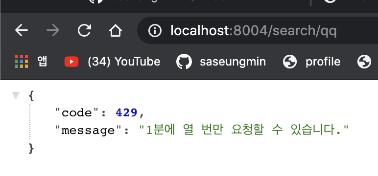
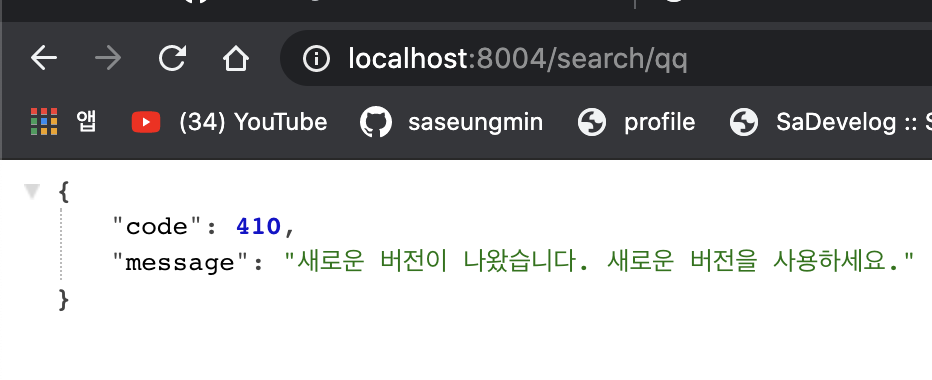

# ✔ 웹 API 서버 만들기
- API(Application Programming Interface)로 다른 애플리케이션에서 현재 프로그램의 기능을 사용할 수 있게 허용하는 접점을 의미한다.
## 🌈 프로젝트 설정
- `package.json` 설정 (`npm install`)
<pre>
  "dependencies": {
    "bcrypt": "^5.0.0",
    "connect-flash": "^0.1.1",
    "cookie-parser": "^1.4.5",
    "dotenv": "^8.2.0",
    "express": "^4.17.1",
    "express-session": "^1.17.1",
    "morgan": "^1.10.0",
    "mysql2": "^2.1.0",
    "passport": "^0.4.1",
    "passport-kakao": "^1.0.0",
    "passport-local": "^1.0.0",
    "pug": "^3.0.0",
    "sequelize": "^6.1.0",
    "uuid": "^8.2.0"
  },
  "devDependencies": {
    "nodemon": "^2.0.4"
  }
</pre>
- `domain.js` 작성 후 `model/index.js` 수정
- `view/login.pug` 작성
- 도메인을 등록하는 이유는 등록한 도메인에서만 API를 사용할 수 있게 하기 위해서이다.
- 웹 브라우저에서 요청을 보낼 때, 응답하는 곳과 도메인이 다르면 CORS(Cross-Origin Resource Sharing) 에러가 발생할 수 있다.
- 무료와 프리미엄은 사용량 제한.
- 클라이언트 비밀키는 다른 애플리케이션 인증 용도로 사용한다.

## 🌈 JWT 토큰 인증
> 참고 링크 : https://jwt.io/introduction/
- JWT(*JSON Web Token*)은 JSON 형식의 데이터를 저장하는 토큰이다.
- JWT는 세 부분으로 구성된다.
> - 헤더 : 토큰 종류와 해시 알고리즘 정보가 들어있다.
> - 페이로드 : 토큰의 내용물이 인코딩된 부분이다.
> - 시그니처 : 일련의 문자열로, 시그니처를 통해 토큰이 변조되었는지 여부를 확인할 수 있다.
- JWT는 내용을 볼 수 있기 때문에 민감한 내용을 넣으면 안 된다.
- JWT 토큰은 JWT 비밀키를 알지 않는 이상 변조가 불가능하다.
- 단점은 내용물이 들어 있기 때문에 용량이 크다.
#### 🔸 JWT 모듈 설치
<pre>
$ npm i jsonwebtoken
</pre>
- `.env`에 `JWT_SECRET=[jwt 토큰 비밀키]` 추가
- `routes/middleware.js`
- 요청 헤더에 저장된 토큰(`req.headers.authorization`)을 사용하고 `jwt.verify` 메서드로 토큰을 검증할 수 있다.
- 첫번째 인자로 토큰을 두번째 인자로는 토큰의 비밀키를 넣어준다.
<pre>
req.decoded = jwt.verify(req.headers.authorization, process.env.JWT_SECRET);
</pre>
- `routes/v1.js` 
<pre>
    // 토큰 생성
    const token = jwt.sign(
      {
        id: domain.user.id, // 사용자 아이디
        nick: domain.user.nick, // 닉네임
      },
      process.env.JWT_SECRET, //토큰 비밀키
      {
        expiresIn: '1m', // 1분 (유효기간)
        issuer: 'seungmin', // 발급자
      },
    );
</pre>
- v1 이라고 지은 이유는 다른 사람이 기존 API를 쓰고 있기 때문에 라우터를 함부로 수정하면 안된다.
- `jwt.sign` 메서드로 토큰을 발급받을 수 있다.
> - `jwt.sign`의 첫 번째 인자는 토큰의 내용이다.(사용자 아이디와 닉네임)
> - 두 번째 인자는 토큰의 비밀키로 유출되면 토큰을 임의로 생성가능하다.
> - 세 번째 인자는 토큰의 설정으로 유효기간을 1분, 발급자를 정해주었다. (1분 = 60 * 1000)
- GET /v1/test 라우터는 사용자가 발급받은 토큰을 테스트하는 라우터로 토큰 검증 미들웨어를 거친다.
<pre>
router.get('/test', verifyToken, (req, res) => {
  res.json(req.decoded);
});
</pre>
- 라우터 서버에 연결
<pre>
// app.js
const v1 = require('./routes/v1');
app.use('/v1', v1);
</pre>

## 🌈 사용량 제한 구현
<pre>
$ npm i express-rate-limit
</pre>
- `routes/middlewares.js`에 `apiLimiter` 라우터 추가한다.
<pre>
const RateLimit = require('express-rate-limit');

exports.apiLimiter = new RateLimit({
  windowMs: 60 * 1000, // 1분 (기준 시간)
  max: 10, // 허용 횟수
  delayMs: 0, // 호출 간격
  handler(req, res) { // 제한 초과 시 콜백 함수 (429)
    res.status(this.statusCode).json({
      code: this.statusCode, // 기본값 : 429
      message: '1분에 열 번만 요청할 수 있습니다.',
    });
  },
});
</pre>
- `routes/middlewares.js`에 `deprecated` 라우터 추가하여 버전이 지난 `v1`라우터를 사용하면 새로운 버전을 사용하라고 알려주는 라우터이다.
<pre>
// 사용하면 안되는 라우터에 붙여준다.
exports.deprecated = (req, res) => {
  res.status(410).json({
    code: 410, // 새 버전
    message: '새로운 버전이 나왔습니다. 새로운 버전을 사용하세요.',
  });
};
</pre>
- 새로운 버전으로 `v2` 라우터를 생성하여 `apiLimiter` 라우터를 미들웨어로 추가해준다.
- `v1`라우터는 `deprecated`라우터를 추가해준다.
<pre>
// v1 라우터 사용시 경고 메시지 출력
router.use(deprecated);
</pre>
- `app.js`에 `v2`라우터를 서버와 연결한다.

- 1분에 10번 요청 초과시

- `v1`으로 요청 시

## 🌈 [SNS API 호출 서버](https://github.com/saseungmin/Node.js-tutorial/tree/master/nodebird-call#-sns-api-%ED%98%B8%EC%B6%9C-%EC%84%9C%EB%B2%84)

## 🌈 [CORS 이해하기](https://github.com/saseungmin/Node.js-tutorial/tree/master/nodebird-call#-cors-%EC%9D%B4%ED%95%B4%ED%95%98%EA%B8%B0)

### 📌 추가 기능 구현해보기
- 팔로워나 팔로잉 목록 가져오는 API 만들기
- 무료인 도메인과 프리미어 도메인 간 사용량 제한 다르게 적용하기
- 클라이언트용과 서버용 비밀키를 구분해서 발급하기
- 클라이언트를 위해 API문서 작성하기