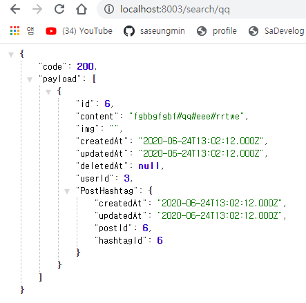
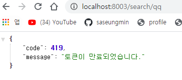
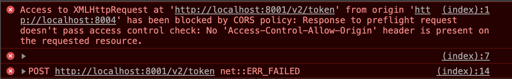
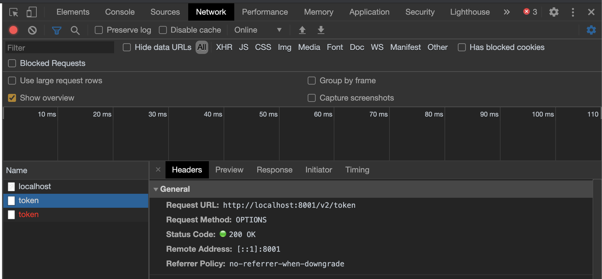
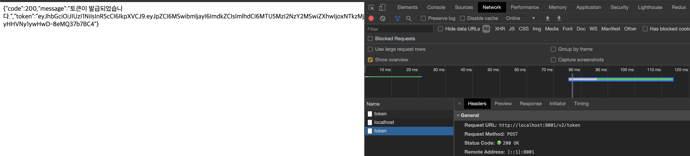
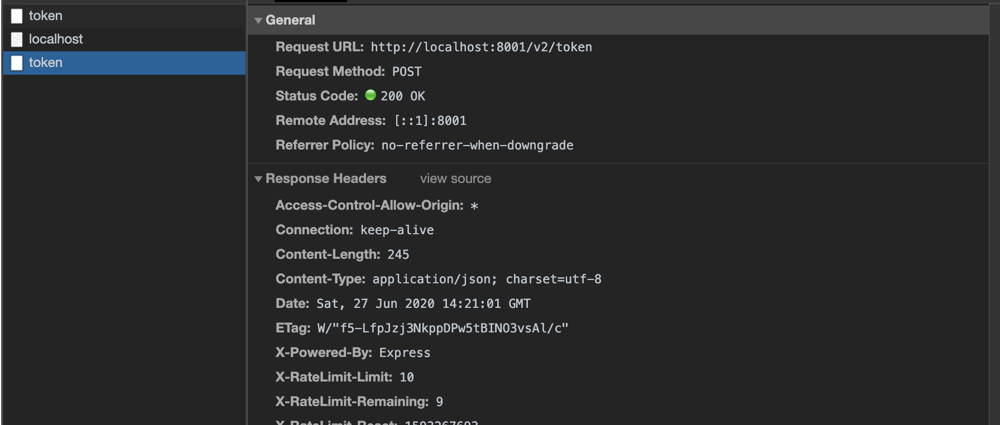
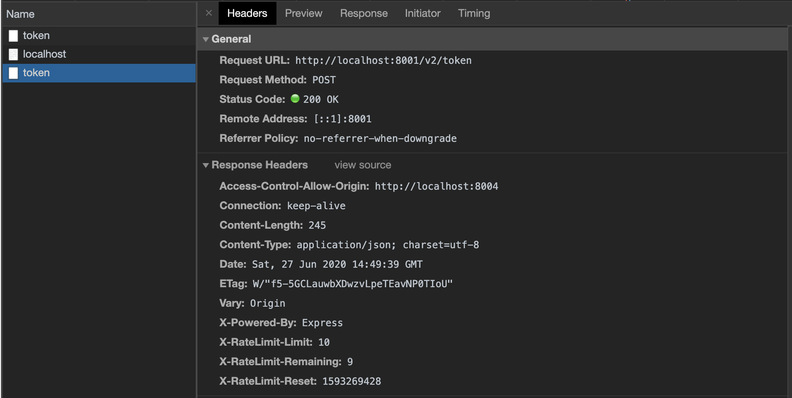

### 📌 참고 문서 
> - Axios 공식 문서 : https://github.com/axios/axios
> - Cors 공식 문서 : https://www.npmjs.com/package/cors
> - JWT 토큰 설명 : https://jwt.io/
> - Json Web Token 공식 문서 : https://www.npmjs.com/package/jsonwebtoken
> - express-rate-limit 공식 문서 : https://www.npmjs.com/package/express-rate-limit
> - UUID 공식 문서 : https://www.npmjs.com/package/uuid

- 이 서버의 목적은 nodebird-api의 API를 통해 데이터를 가져온다.
- *package.json* 의존성 설치 `$ npm i`
<pre>
  "dependencies": {
    "axios": "^0.19.2",
    "cookie-parser": "^1.4.5",
    "dotenv": "^8.2.0",
    "express": "^4.17.1",
    "express-session": "^1.17.1",
    "morgan": "^1.10.0",
    "pug": "^3.0.0"
  },
  "devDependencies": {
    "nodemon": "^2.0.4"
  }
</pre>

- API를 사용하려면 사용자 인증을 받아야 하므로 `clientSecret`를 `.env`에 넣는다.
<pre>
COOKIE_SECRET=[쿠키 비밀키]
CLIENT_SECRET=[클라이언트 비밀키]
</pre>
#### 🔸 다른 서버로 요청을 보내는 데는 `axios` 패키지를 사용하고, 프로미스 기반으로 동작하므로 `async/await` 문법과 함께 사용할 수 있다.
- `axios.get(주소, {headers:{헤더}}`를 하면 해당 주소에 헤더와 함께 GET 요청을 보낸다.
<pre>
// API 요청
return await axios.get(`http://localhost:8002`, {
    headers: { authorization: req.session.jwt },
});
</pre>
- `axios.post(주소, {데이터})`를 하면 해당 주소에 POST 요청을 보내면서 요청 본문에 데이터를 실어 보낸다.
<pre>
const tokenResult = await axios.post(`${URL}`, {
    clientSecret: process.env.CLIENT_SECRET,
});
</pre>
- 응답 결과는 `await`으로 받은 객체의 `data` 속성에 들어 있다. `result.data`나 `tokenResult.data`가 API 서버에서 보내주는 응답 값이다.
<pre>
res.json(result.data);
</pre>

## 🌈 SNS API 호출 서버
- `nodebird-api/routes/v1.js` 수정
- `nodebird-call/routes/index.js` 코드 리팩토리
> - 결과값의 코드에 따라 성공 여부를 알 수 있고, 실패한 경우에도 실패 종류를 알 수 있다.
> - GET /mypost 라우터는 자신이 작성한 포스트를 JSON 형식으로 가져오는 라우터
> - GET /search/:hashtag 라우터는ㄴ 해시태그를 검색하여 해시태그를 포함하는 포스트를 가져오는 라우터이다.
- 내 포스트

- 해시태그 검색

- 토큰 만료(1분)

## 🌈 CORS 이해하기
- nodebird-call의 프런트에서 nodebird-api의 서버 API 호출
- `routes/index.js` `main`라우터 추가
<pre>
router.get('/',(req, res) => {
  res.render('main', {key:process.env.CLIENT_SECRET});
})
</pre>
- `views/main.pug` 작성
- `Access-Control-Allow-Origin`이라는 헤더가 없다는 내용의 에러 발생.

- 클라이언트에서 서버로 요청을 보낼 때는, **클라이언트와 서버의 도메인이 일치하지 않으면 기본적으로 요청이 차단된다.**
- 위 같은 문제를 CORS(Cross-Origin-Resource Sharing) 문제라고 한다.
- 네트워크 tab에서 Method가 POST로 보냈지만 대신 OPTIONS로 표시된다.
- OPTIONS **메서드는 실제 요청을 보내기 전에 서버가 이 도메인을 허용하는지 체크하는 역할을 한다.**

- CORS 문제를 해결하기 위해 응답 헤더에 `Access-Control-Allow-Origin` 이라는 헤더를 넣어주어야 한다.
- 이 헤더는 클라이언트 도메인의 요청을 허락하겠다는 뜻을 가지고 있다.
- 응답은 서버에서 보내는 것이기 때문에 응답 헤더를 조작할려면 `nodebird-call`이 아니라 `nodebird-api`에서 바꿔준다.
- `nodebird-api`에 cors 모듈을 설치한다.
<pre>
$ npm i cors
</pre>

- `nodebird-api/routes/v2.js` 수정
- cors 미들웨어 적용
<pre>
const cors = require('cors');
router.use(cors());
</pre>

- 응답 헤더에 `Access-Control-Allow-Origin`이 *으로 되어있는 것은 모든 클라이언트의 요청을 허용한다는 것이다.

- 하지만 이것은 요청을 보내주는 주체가 클라이언트라서 비밀키가 모두에게 노출된다.
- 때문에 이 비밀키를 가지고 다른 도메인들이 API 서버에 요청을 보낼 수 있다.
- 이 문제를 막기 위해서는 처음에 비밀키 발급 시 허용한 도메인을 적게 하여 호스트와 비밀키가 모두 일치할 때만 CORS를 허용하게 수정한다.
<pre>
const cors = require('cors');
const url = require('url');

// 호스트와 비밀키가 모두 일치할 경우 cors 허용
router.use(async (req, res, next) => {
  const domain = await Domain.findOne({
    where: { host: url.parse(req.get('origin')).host }, // http와 https를 때어낼때는 url.parse 메서드를 사용한다.
  });
  if (domain) {
    cors({ origin: req.get('origin') })(req, res, next); // cors를 사용해서 다음 미들웨어로 전송
  } else {
    next(); //없다면 cors를 때고 다음 미들웨어 전송
  }
});
</pre>
- 먼저 도메인 모델로 클라이언트 도메인(req.get('origin'))과 호스트가 일치하는 것 인지를 검사한다.
- 일치하는 것이 있다면 cors를 허용하여 다음 미들웨어로 보내고, 일치하는 것이 없다면 cors없이 next를 호출한다.
- `Access-Control-Allow-Origin` 확인

- 클라이언트와 서버에서 같은 비밀키를 써서 문제가 될 수 있다. 따라서 환경별로 키를 구분해서 발급하는 것이 바람직하다.
- 카카오인 경우 REST API 키가 서버용 비밀키이고, Javascript 키가 클라이언트용 비밀키이다.
