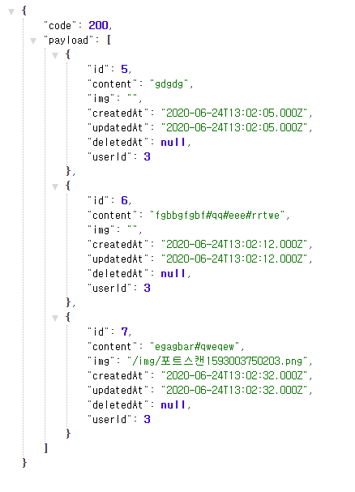

## ✔️ API 호출 서버
> 📌 참고 문서 : https://github.com/axios/axios
- 이 서버의 목적은 nodebird-api의 API를 통해 데이터를 가져온다.
- *package.json* 의존성 설치 `$ npm i`
<pre>
  "dependencies": {
    "axios": "^0.19.2",
    "cookie-parser": "^1.4.5",
    "dotenv": "^8.2.0",
    "express": "^4.17.1",
    "express-session": "^1.17.1",
    "morgan": "^1.10.0",
    "pug": "^3.0.0"
  },
  "devDependencies": {
    "nodemon": "^2.0.4"
  }
</pre>

- API를 사용하려면 사용자 인증을 받아야 하므로 `clientSecret`를 `.env`에 넣는다.
<pre>
COOKIE_SECRET=[쿠키 비밀키]
CLIENT_SECRET=[클라이언트 비밀키]
</pre>
#### 🔸 다른 서버로 요청을 보내는 데는 `axios` 패키지를 사용하고, 프로미스 기반으로 동작하므로 `async/await` 문법과 함께 사용할 수 있다.
- `axios.get(주소, {headers:{헤더}}`를 하면 해당 주소에 헤더와 함께 GET 요청을 보낸다.
<pre>
// API 요청
return await axios.get(`http://localhost:8002`, {
    headers: { authorization: req.session.jwt },
});
</pre>
- `axios.post(주소, {데이터})`를 하면 해당 주소에 POST 요청을 보내면서 요청 본문에 데이터를 실어 보낸다.
<pre>
const tokenResult = await axios.post(`${URL}`, {
    clientSecret: process.env.CLIENT_SECRET,
});
</pre>
- 응답 결과는 `await`으로 받은 객체의 `data` 속성에 들어 있다. `result.data`나 `tokenResult.data`가 API 서버에서 보내주는 응답 값이다.
<pre>
res.json(result.data);
</pre>

## ✔️ SNS API 호출 서버
- `nodebird-api/routes/v1.js` 수정
- `nodebird-call/routes/index.js` 코드 리팩토리
> - 결과값의 코드에 따라 성공 여부를 알 수 있고, 실패한 경우에도 실패 종류를 알 수 있다.
> - GET /mypost 라우터는 자신이 작성한 포스트를 JSON 형식으로 가져오는 라우터
> - GET /search/:hashtag 라우터는ㄴ 해시태그를 검색하여 해시태그를 포함하는 포스트를 가져오는 라우터이다.
- 내 포스트

- 해시태그 검색

- 토큰 만료(1분)

