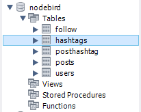
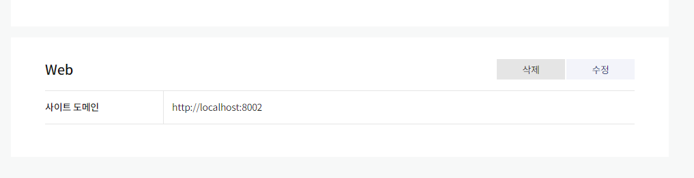
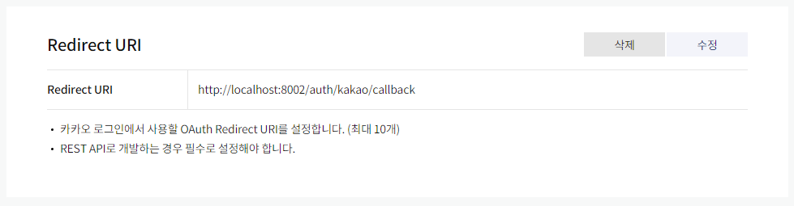
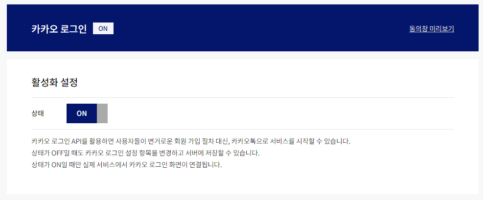
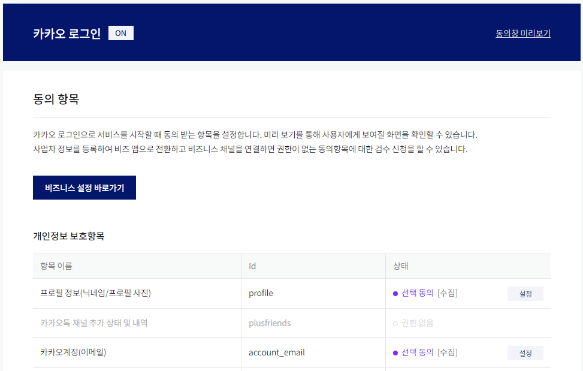

# ✔️ 익스프레스로 SNS 서비스 만들기
### 📌 참고 자료
> - Passport 공식 문서 : http://www.passportjs.org/
> - Multer 공식 문서 : https://github.com/expressjs/multer/blob/master/doc/README-ko.md
> - Dotenv 공식 문서 : https://github.com/motdotla/dotenv#readme
> - Bcrypt 공식 문서 : https://www.npmjs.com/package/bcrypt

### ✒ 프로젝트 기본 설정
<pre>
// package.json 설치
$ npm init
// 시퀄라이즈 설치
$ npm i -g sequelize-cli
$ npm i sequelize mysql2
$ sequelize init
</pre>
- 루트 폴더에 app.js파일 생성과 템플릿 파일을 넣을 views 폴더와 라우터를 넣을 routes 폴더, 정적 파일을 넣을 public 폴더를 생성한다.
- 템플릿 엔진인 pug 설치
<pre>
$ npm i express cookie-parser express-session morgan connect-flash pug
$ npm i -g nodemon
$ npm i -D nodemon
</pre>
- nodemon 모듈로 서버를 자동으로 재시작한다.(개발용으로만 권장)

- `dotenv`를 사용하여 `cookieParser`와 `express-session`의 비밀키는 직접 하드코딩하지 않는다.
- 키를 하드코딩하면 소스 코드가 유출되었을 떄 키도 같이 유출되므로 별도로 관리해야한다.
<pre>
$ npm i dotenv
</pre>
- `.env` 파일 생성
<pre>
COOKIE_SECRET=비밀키
</pre>
#### 🔸 view 단 만들기
- views 폴더

##  🌈 데이터베이스 세팅
- MySQL과 시퀄라이즈로 데이터베이스 설정
#### 🔸 models 폴더 안에 `user.js, post.js, hashtag.js` 생성
- `provider`가 local이면 로컬 로그인을 한 것이고, kakao면 카카오 로그인을 한 것이다.
<pre>
provider: {
    type: DataTypes.STRING(10),
    allowNull: false,
    // default 값
    defaultValue: 'local',
}
</pre>
- `timestamps`가 `true`이면 테이블을 생성한 후 자동적으로 `createdAt`, `updatedAt` column을 생성
- `paranoid`가 `true`이면 `deletedAt` column이 table에 추가된다.
- 해당 row를 삭제 시 실제로 데이터가 삭제되지 않고 deletedAt에 삭제된 날짜가 추가되며 deletedAt에 날짜가 표기된 row는 find작업 시 제외된다.
<pre>
{
    timestamps: true,
    paranoid: true,
}
</pre>
#### 🔸 index.js 폴더 수정(시퀄라이즈 관계)
- User와 Post는 1:N 관계로 시퀄라이즈는 Post 모델에 userId 컬럼를 추가한다.
<pre>
db.User.hasMany(db.Post);
db.Post.belongsTo(db.User);
</pre>
- Post와 Hashtag의 관계는 N:M 이다.(해시태그 하나에 여러개의 게시글을 가질 수 있고, 게시글 하나에 해시태그 여러개를 가질 수 있다.)
- N:M관계는 중간에 관계 테이블이 생성된다.
- 시퀄라이즈가 관계를 분석하여 `PostHashtag` 테이블을 자동 생성한다.
<pre>
// 컬럼명은 postId와 hashtagId 이다.
db.Post.belongsToMany(db.Hashtag, { through: 'PostHashtag' });
db.Hashtag.belongsToMany(db.Post, { through: 'PostHashtag' });
</pre>
- 같은 테이블끼리도 N:M 관계를 가질 수 있다. (팔로잉 기능도 N:M이다.)
- 같은 테이블일때는 이름을 따로 정해주어야 한다.
<pre>
db.User.belongsToMany(db.User, {
  // foreignKey옵션으로 두 사용자 아이디를 구별한다.
  foreignKey: 'followingId',
  // as는 시퀄라이즈가 JOIN 작업 시 사용하는 이름이다.
  as: 'Followers',
  through: 'Follow',
});
db.User.belongsToMany(db.User, {
  foreignKey: 'followingId',
  as: 'Followings',
  through: 'Follow',
});
</pre>
- config.json 수정
- 데이터베이스 생성
<pre>
$ sequelize db:create
</pre>
- 모델을 서버와 연결(app.js)
<pre>
const { sequelize } = require('./models');
sequelize.sync();
</pre>
- 시퀄라이즈는 테이블 생성 쿼리문에 `IF NOT EXISTS`를 넣어주므로 테이블이 없을 떄 자동으로 생성한다.
<pre>
$ npm start
Executing (default): CREATE TABLE IF NOT EXISTS `users` (`id` INTEGER NOT NULL auto_increment , `email` VARCHAR(40) UNIQUE, `nick` VARCHAR(15), `password` VARCHAR(100), `provider` VARCHAR(10) NOT NULL DEFAULT 'local', `snsId` VARCHAR(30), `createdAt` DATETIME NOT NULL, `updatedAt` DATETIME NOT NULL, `deletedAt` DATETIME, PRIMARY KEY (`id`)) ENGINE=InnoDB;
Executing (default): SHOW INDEX FROM `users` FROM `nodebird`
Executing (default): CREATE TABLE IF NOT EXISTS `posts` (`id` INTEGER NOT NULL auto_increment , `content` VARCHAR(140) NOT NULL, `img` VARCHAR(200), `createdAt` DATETIME NOT NULL, `updatedAt` DATETIME NOT NULL, `deletedAt` DATETIME, `userId` INTEGER, PRIMARY KEY (`id`), FOREIGN KEY (`userId`) REFERENCES `users` (`id`) ON DELETE SET NULL ON UPDATE CASCADE) ENGINE=InnoDB;
Executing (default): SHOW INDEX FROM `posts` FROM `nodebird`
Executing (default): CREATE TABLE IF NOT EXISTS `hashtags` (`id` INTEGER NOT NULL auto_increment , `title` VARCHAR(15) NOT NULL UNIQUE, `createdAt` DATETIME NOT NULL, `updatedAt` DATETIME NOT NULL, `deletedAt` DATETIME, PRIMARY KEY (`id`)) ENGINE=InnoDB;
</pre>
- 테이블 생성 

##  🌈 Passport 모듈로 로그인 구현하기
<pre>
$ npm i passport passport-local passport-kakao
$ npm install bcrypt --save
</pre>
- `Passport`모듈을 app.js 와 연결
- `req.session`객체는 `express-session`에서 생성하는 것이므로 `passport` 미들웨어는 `express-session` 미들웨어보다 뒤에 연결해야 된다.
<pre>
const passport = require('passport');
const passportConfig = require('./passport');
// 요청(req 객체)에 passport 설정을 심는다.
app.use(passport.initialize());
// req.session 객체에 passport 정보를 저장한다.
app.use(passport.session());
</pre>
- `serializeUser`는 `req.session` 객체에 **어떤 데이터를 저장**할지 선택한다. (매개변수로 user를 받아 done 함수에 두 번째 인자로 user.id를 넘긴다.)
- **첫 번째 인자는 오류**를 발생 시 사용하는 것이므로 두 번째 인자가 중요하다.
- 세션에 사용자 정보를 모두 저장하면 세션의 **용량이 커지고** **데이터 일관성에 문제**가 발생하므로 사용자의 아이디만 저장한다.
- `deserializeUser`는 **매 요청 시 실행된다.** (`passport.session()` 미들웨어가 이 메서드를 호출한다.)
- `serializeUser`에서 세션에 저장했던 아이디를 받아 데이터베이스에서 사용자 정보를 조회한다.
- 조회한 정보를 `req.user`에 저장하므로 앞으로 `req.user`를 통해 로그인한 사용자 정보를 가져올 수 있다.
<pre>
// passport/index.js
module.exports = (passport) => {
  passport.serializeUser((user, done) => {
    done(null, user.id);
  });
  passport.deserializeUser((id, done) => {
    User.findOne({ where: { id } })
      .then((user) => done(null, user))
      .catch((err) => done(err));
  });

  local(passport);
  kakao(passport);
};
</pre>
- 즉, `serializeUser`는 사용자 정보 객체를 세션에 아이디로 저장하는 것이고, `deserializeUser`는 세션에 저장한 아이디를 통해 사용자 정보 객체를 불러오는 것이다.
#### 📌 passport 전체 과정
> 1. 로그인 요청이 들어옴
> 2. `passport.authenticate` 메서드 호출
> 3. 로그인 전략 수행
> 4. 로그인 성공 시 사용자 정보 객체와 함께 `req.login` 호출
> 5. `req.login` 메서드가 `passport.serializeUser` 호출
> 6. `req.session`에 사용자 아이디만 저장
> 7. 로그인 완료
- 로그인 이후 과정
> 1. 모든 요청에 `passport.session()` 미들웨어가 `passport.deserializeUser` 메서드 호출
> 2. `req.session`에 저장된 아이디로 데이터베이스에서 사용자 조회
> 3. 조회된 사용자 정보를 `req.user`에 저장
> 4. 라우터에서 `req.user` 객체 사용 가능

### ✨ 로컬 로그인 구현
- SNS 서비스를 통해 로그인하지 않고, 자체적으로 회원가입 후 로그인하는 것이다.
- `Passport`에서 이를 구현할려면 `passport-local` 모듈이 필요하다.
- 접근 권한을 제어하는 미들웨어 생성(routes/middlewares.js)
- 자신의 프로필은 로그인을 해야 볼 수 있으므로 `isLoggedIn` 미들웨어를 사용해서 로그인 되있으면 `next()`가 호출되어 `res.render`가 있는 미들웨어로 넘어갈 수 있다.
<pre>
router.get('/profile', isLoggedIn, (req, res) => {
  res.render('profile', { title: '내 정보 - NodeBird', user: req.user });
});
</pre>
- 회원가입 페이지는 로그인을 하지 않은 사람에게만 보여야 되니까 `isNotLoggedIn` 미들웨어로 `req.isAuthenticated()` 가 `false`일 때만 `next()`를 호출한다.
<pre>
router.get('/join', isNotLoggedIn, (req, res) => {
  res.render('join', { title: '회원가입 - NodeBird', user: req.user, joinError: req.flash('joinError') });
});
</pre>
#### 🔸 회원가입, 로그인, 로그아웃 라우터 생성(routes/auth.js 참고)
- 로그인 라우터로 `passport.authenticate('local')` 미들웨어가 로컬 로그인 전략을 수행한다.
- 콜백 함수의 첫번째인자(authError)가 존재하면 실패, 두번째 인자가 존재하면 성공
- 성공하면 `req.login` 메서드를 호출하고 `req.login`는 `passport.serializeUser` 를 호출한 뒤, `req.login`에 제공하는 `user`객체가 `serializeUser`로 넘어가게 된다. 
<pre>
router.post('/login', isNotLoggedIn, (req, res, next) => {
  passport.authenticate('local', (authError, user, info) => {
    //.... 생략
    return req.login(user, (loginError) => {
      if (loginError) {
        return next(loginError);
      }
      return res.redirect('/');
    });
  })(req, res, next); // 미들웨어 내의 미들웨어는 (req,res,next)를 붙인다.
})
</pre>
#### 🔸 local 로그인 전략(Strategy) 구성(passport/localStrategy.js)
- `const LocalStrategy = require('passport-local').Strategy;` : `passport-local` 모듈에서 `Strategy` 생성자를 불러와 사용한다.
- 첫번째인자로 주어진 객체는 전략(Strategy)에 관한 설정을 하는 곳이다.
- `usernameField`와 `passwordField`에 일치하는 `req.body`의 속성명에 해당한다.
<pre>
module.exports = (passport) => {
  passport.use(new LocalStrategy(
    {
      usernameField: 'email',
      passwordField: 'password',
    },
    // 생략...
  ));
}
</pre>
- 두 번째 인자로 실제 전략을 수행하는 `async` 함수이다.
- 첫 번쨰 인자에서 넣어준 email과 password는 `async`의 첫 번쨰, 두 번째 매개변수가 된다.
- 세 번째 매개변수인 `done`함수는 `passport.authenticate`의 콜백 함수이다.
<pre>
module.exports = (passport) => {
    // 생략...
    ,async (email, password, done) => {
      try {
        const exUser = await User.findOne({ where: { email } });
        if (exUser) {
          const result = await bcrypt.compare(password, exUser.password);
          if (result) {
            done(null, exUser);
          } else {
            done(null, false, { message: '비밀번호가 일치하지 않습니다.' });
          }
        } else {
          done(null, false, { message: '가입되지 않은 회원입니다.' });
        }
      } catch (error) {
        console.error(error);
        done(error);
      }
    }
}
</pre>

#### ✨ done과 authenticate의 관계
- `done(null, false, { message: 'error' });` => `passport.authenticate('..',(authError, user, info))`
- `done`이 호출된 후에는 다시 `passport.authenticate`의 콜백 함수에서 나머지 로직이 실행된다.
> 1. 로그인 성공 시
<pre>
                          done(null, exUser);
passport.authenticate('local',(authError, user, info) => {})
</pre>
> 2. 로그인 실패 시
<pre>
                          done(null, false, { message: '비밀번호가 일치하지 않습니다.' });
passport.authenticate('local',(authError, user, info) => {})
</pre>
> 3. 서버 에러 시
<pre>
                            done(error);
passport.authenticate('local',(authError, user, info) => {})
</pre>

### ✨ 카카오 로그인 구현하기
#### 📌 카카오 passport 참고 문서 : http://www.passportjs.org/packages/passport-kakao/
- `passport/kakaoStrategy.js` 참고 (`localStrategy`와 유사)
- `routes/auth.js`에 카카오 로그인 라우터 생성
- 카카오 로그인 창으로 리다이렉트하고 결과를 `GET /auth/kakao/callback` 으로 받는다.
- 카카오 로그인은 내부적으로 `req.login`을 호출하므로 `passport.authenticate` 메서드에 콜백 함수를 제공하지 않는다. 
<pre>
// 카카오 로그인 과졍 (/auth/kakao)
router.get('/kakao', passport.authenticate('kakao'));

// 카카오 로그인 전략 수행
router.get(
  '/kakao/callback',
  passport.authenticate('kakao', {
    // 로그인 실패했을 떄 이동
    failureRedirect: '/',
  }),
  (req, res) => {
    // 성공 시 이동
    res.redirect('/');
  },
);
</pre>
- `app.js`에 `auth.js` 연결
- https://developers.kakao.com/ 에 접속 후 회원가입
- 앱 생성 참고 (https://developers.kakao.com/docs/latest/ko/getting-started/app)
- 생성 후 REST API 키를 `.env`에 등록
<pre>
COOKIE_SECRET=[쿠키 키]
KAKAO_ID=[REST API 키]
</pre>
- 내 애플리케이션 > 앱 설정 > 플랫폼 > Web에 사이트 도메인 추가

- 내 애플리케이션 > 제품설정 > 카카오 로그인 > Redirect URI에 `/auth/kakao/callback` 입력후 저장 (`kakaoStrategy.js`의 `callbackURL`과 일치해야 한다.)

- 카카오 로그인 API 사용 활성화

- 내 애플리케이션 > 제품설정 > 카카오 로그인 > 동의항목에 프로필 정보, 카카오계정(이메일) 수집 설정

### 📌 그 외에 Passport : [구글](http://www.passportjs.org/packages/passport-google-oauth2/), [페이스북](http://www.passportjs.org/packages/passport-facebook/), [네이버](http://www.passportjs.org/packages/passport-naver/), [트위터](http://www.passportjs.org/packages/passport-twitter/), [github](http://www.passportjs.org/packages/passport-github/)

##  🌈 Multer 모듈로 이미지 업로드 하기
- `form` 인코딩 타입은 `multipart/form-data` 이다.
- 이런 형태는 직접 처리하기 힘드므로 편하게 해주는 `multipart` 처리용 모듈인  `Multer`를 사용한다.
<pre>
$ npm i multer
</pre>
#### 📌 `routes/post.js`  주석 참고
- `storage` 속성은 파일 저장 방식과 경로, 파일명 등을 설정한다.
- `multer.diskStorag`e를 사용해 이미지가 서버 디스크에 저장되도록 한다.
-  `destination` 저장경로를 nodebird 폴더 아래 uploads 폴더로 지정한다.
<pre>
const upload = multer({
  storage: multer.diskStorage({
    destination(req, file, cb) {
      cb(null, 'uploads/');
    },
    // 파일이름 설정
    filename(req, file, cb) {
      const ext = path.extname(file.originalname);
      cb(null, path.basename(file.originalname, ext) + Date.now() + ext); 
    },
  }),
  // 최대 이미지 파일 용량 허용치(바이트 단위) 10MB
  limits: { fileSize: 5 * 1024 * 1024 },
});
</pre>
#### 📌`multer`로 만들어진 `upload` 변수는 여러 가지 메서드를 가지고 있다.
> - `single`은 하나의 이미지를 업로드할 때 사용하며, `req.file` 객체를 생성한다.
> - `array`와 `fields`는 여러 개의 이미지를 업로드할 때 사용하며, `req.file` 객체를 생성한다.
> - `array`와 `fields`의 차이점은 이미지를 업로드한 `body` 속성 개수로 속성 하나에 이미지를 여러 개 업로드했다면 `array`, 여러 개의 속성에 이미지를 하나씩 업로드했다면 `fields`를 사용한다.
> - `none`은 이미지 올리지 않고 데이터만 `multipart` 형식으로 전송했을 때 사용한다.

##  🌈 해시태그 검색 기능과 팔로잉 기능
- `routes/user.js, routes/post.js` 소스코드 참고

### ✒ 추가 기능 구현해보기
> - 팔로잉 끊기(시퀄라이즈의 destroy 메서드와 라우터 활용하기)
> - 프로필 정보 변경하기 (시퀄라이즈의 update 메서드와 라우터 활용)
> - 게시글 좋아요 및 취소하기(사용자 - 게시글 모델 간 N:M 관계 정립 후 라우터 활용)
> - 게시글 삭제하기 (등록자와 현재 로그인한 사용자가 같을 떄, 시퀄라이즈의 destroy 메서드와 라우터 활용)