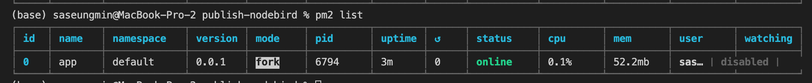
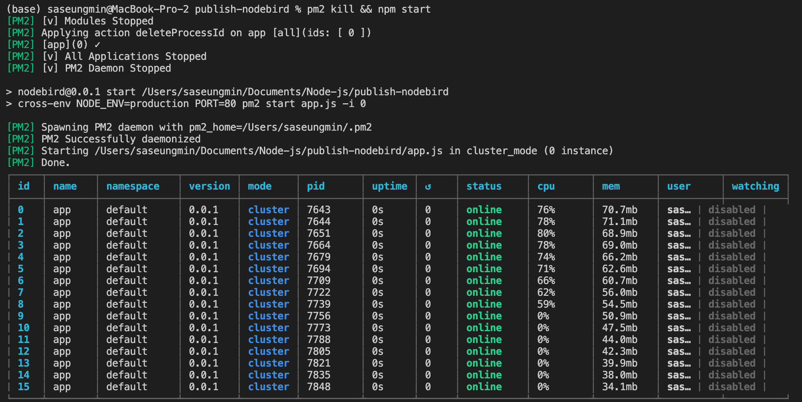
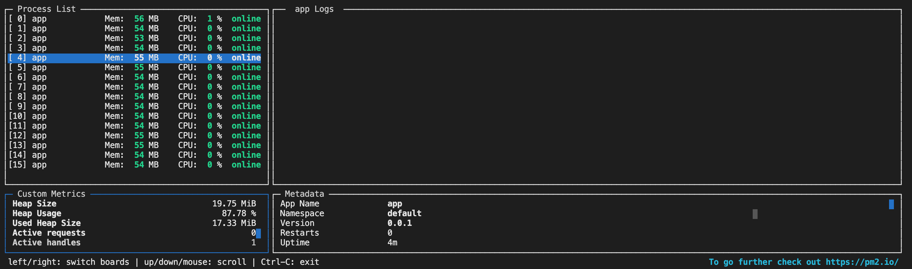
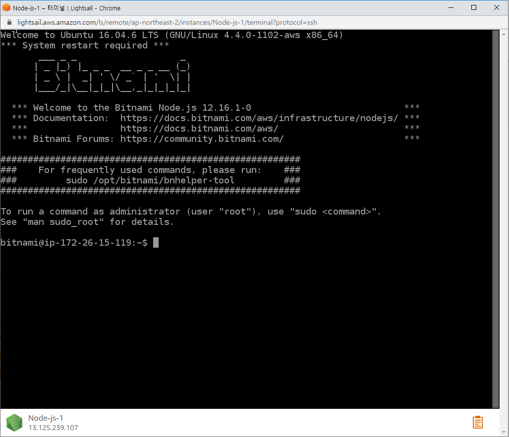

# ✔️ AWS와 GCP로 배포하기
- nodebird 배포하기
## 🌈 서비스 운영을 위한 패키지
- 서비스를 출시한 이후에 서버에 문제가 생기면 서비스 자체에 문제가 된다.
- 또한, 서비스의 취약점을 노린 공격이 들어온다.
### 🔸 morgan과 express-session
- 익스프레스 미들웨어 중 일부가 개발용으로 설정되어 있기 때문에 배포용으로 설정헤준다.
- `process.env.NODE_ENV`는 배포 환경인지 개발 환경인지 판단할 수 있는 환경 변수이다.
- 배포 환경일 때는 `morgan`을 `combined` 모드로 사용하고, 개발 환경일 때는 `dev` 모드로 사용한다.
- `combined` 모드는 `dev` 모드에 비해 더 많은 사용자 정보를 로그로 남긴다.
<pre>
if(process.env.NODE_ENV === 'production'){
  app.use(morgan('combined'));
}else{
  app.use(morgan('dev'));
}
</pre>
- `process.env.NODE_ENV`는 `.env`에 넣을 수 없다.
- 이유는 개발 환경인지 배포 환경인지에 따라 값이 변해야 하는데, `.env` 파일은 정적 파일이기 때문이다.
- `NODE_ENV`를 `cross-env`를 사용해서 동적으로 바꿀 수 있다.
- `express-session`을 배포용으로 설정해준다.
<pre>
if(process.env.NODE_ENV === 'production'){
  sessionOption.proxy = true;
  //sessionOption.cookie.secure = true;
}
</pre>
- 배포환경일 때는 `proxy`를 `true`로, `cookie.secure`를 `true`로 바꿔준다.
- 하지만 무조건적이진 않고, https를 적용할 경우에만 사용하면 된다.
- `proxy`를 `true`로 적용할 경우에는 https 적용을 위해 노드 서버 앞에 다른 서버를 두었을 때이다.
- `cookie.secure` 또한, https 적용이나 로드밸런싱드을 위해 `true`로 바꿔준다.

### 🔸 sequelize
- 데이터베이스도 배포 환경으로 설정해준다.
- 시퀄라이즈에서 가장 큰 문제는 비밀번호가 하드코딩되어 있따는 점으로 JSON 파일이므로 변수를 사용할 수 없다.
- 하지만 시퀄라이즈는 JSON 대신 JS 파일을 설정 파일로 쓸 수 있게 지원한다.
- config 파일에서 config.json 삭제 후 config.js로 생성(js 파일이면 `dotenv`모듈 사용가능)
<pre>
  production: {
    username: 'root',
    password: <b>process.env.SEQUELIZE_PASSWORD</b>,
    database: 'database_production',
    host: '127.0.0.1',
    dialect: 'mysql',
    operatorsAliases: false,
    logging: false,
  },
</pre>
- 쿼리를 수행할 때마다 콘솔에 SQL문이 노출이 되기 때문에, 배포 환경에서는 수행되는지를 숨겨야 한다.
<pre>
logging: false
</pre>
- `.env` 파일에 데이터베이스 비밀번호 입력한다.
<pre>
SEQUELIZE_PASSWORD:[데이터베이스 비밀번호]
</pre>
- 배포 환경에서 데이터베이스에 한글이 저장되지 않는 문제가 발생할 수도 있다.
<pre>
// model/..
    {
      timestamps: true,
      paranoid: true,
      <b>charset: 'utf8',
      collate: 'utf8_general_ci',</b>
    },
</pre>

### 🔸 cross-env
- `croos-env`를 사용하면 동적으로 `process.env`를 변경할 수 있다.
- 또한, 모든 운영체제에서 동일한 방법으로 변경할 수 있게 된다.
#### ✌ Linux, MacOS
<pre>
// package.json
  "scripts": {
    // 배포 환경 / 스크립트 실행시 process.env를 동적으로 설정하는 방법
    "start": "NODE_ENV=production PORT=80 node app",
    // 개발 환경
    "dev": "nodemon app"
  },
</pre>

#### ✌ window OS
- 위와 같은 방법이 window에서는 안되기 때문에 cross-env를 사용한다.
<pre>
// console
$ npm i -g cross-env && npm i cross-env
// package.json
  "scripts": {
    "start": "cross-env NODE_ENV=production PORT=80 node app",
    "dev": "nodemon app"
  },
</pre>

### 🔸 retire
- 패키지에서 취약점이 발견된 경우에는 패키지에 문제는 없는지 확인해 보아야 한다.
- 이를 위해 retire 패키지를 전역 설치한다.
<pre>
$ npm i -g retire
$ retire
// 문제가 있는 패키지가 있다면 콘솔에 내용이 출력된다.
</pre>

#### ✌ npm audit
- npm 5.10부터 npm audit이라는 명령어가 추가되었다.
- npm install을 할 때 자동으로 취약점을 검사하고 npm audit fix를 입력하면 npm이 수정할 수 있는 오류는 자동으로 수정해준다.
- 때문에, npm 5.10 이상이면 retire 패키리를 사용하지 않아도 된다.

### 🔸 pm2
- pm2는 원활한 서버 운영을 위한 패키지이다.
- 가장 큰 기능은 서버가 에러로 인해 꺼졌을 때 서버를 다시 켜주는 것이다.
- 또한, 멀티 쓰레딩은 아니지만 멀티 프로세싱을 지원하여 노드 프로세스 개수를 1개 이상으로 늘릴 수 있다.
- 노드는 클라이언트로부터 요청이 왔을 때 요청을 여러 노드 프로세스에 고르게 분배한다.
- 단점은 멀티 쓰레딩이 아니므로 서버의 메모리 같은 자원을 공유하지는 못한다.
- 예를 들어 로그인 후 새로고침을 반복했을 때, 세션 메모리가 있는 프로세스로 요청이 거묜 로그인 상태가 되고, 세션 메모리가 없는 프로세스로 요청이 가면 로그인이 안 된 상태가 된다.
- 이를 위해서 `Memcached`나 레디스(`Redis`) 같은 서비스를 사용한다.
- 콘솔에 pm2를 전역 설치한다.
<pre>
$ npm i -g pm2 && npm i pm2
</pre>
- nodemon 대신 pm2를 쓰도록 npm start 스크립트를 수정한다.
<pre>
  "scripts": {
    "start": "cross-env NODE_ENV=production PORT=80 <b>pm2 start app.js</b>",
    "dev": "nodemon app"
  },
</pre>
- 그리고 `npm start`로 명령어 실행.
- pm2를 사용시 다른 node나 nodemon 명령어로 실행했을 때와 다르게 노드 프로세스가 실행되면서 콘솔에 다른 명령어를 입력할 수 있다.
- pm2가 노드 프로세스를 백그라운드로 돌린다.
- 리눅스나 맥에서 pm2 실행 시 1024번 이하의 포트를 사용할려면 관리자 권한이 필요하기 때문에 sudo 명령어를 사용해서 실행한다.
- 백그라운드로 돌고 있는 노드 프로세스를 확인할려면 `pm2 list`를 콘솔에 명령어를 치면 된다.

- pm2 프로세스를 종료할려면 콘솔에 `pm2 kill`을 입력한다.
- 서버를 재시작할려면 `pm2 reload all`을 입력한다. (다운타임(서버가 중지되어 클라이언트가 접속할 수 없는 시간)이 거의 없어서 서버가 재시작되어 좋다.)

- 노드의 `cluster`모듈처럼 클러스터링 가능하게 하는 pm2의 클러스터링 모드를 사용
- `-i`뒤에 오는 숫자는 생성하기 원하는 프로세스 개수를 기입하면 된다.
- 0은 cpu 코어 개수만큼 프로세스를 생성한다는 뜻이고, -1은 프로세스를 CPU 코어 개수보다 한개 덜 생성하겠다는 뜻이다.
<pre>
  "scripts": {
    "start": "cross-env NODE_ENV=production PORT=80 pm2 start app.js <b>-i 0</b>",
    "dev": "nodemon app"
  },
</pre>
- 서버를 종료한 뒤 변경된 명령어 사용하기 위해 서버 실행
<pre>
$ pm2 kill && npm start
</pre>

- 현재 프로세스를 모니터링하기
<pre>
$ pm2 monit
</pre>

### 🔸 winston
- 실제 서버 운영 시 `console.log`와 `console.error`를 대체하기 위한 모듈이다.
- `console.log`와 `console.error`를 사용하면 개발 중에는 편리하게 서버의 상황을 파악할 수 있지만, 실제 배포 시에는 사용하기 어렵다.
- 서버가 종료되는 순간 로그들도 사라져 버리기 때문이다.
- 이와 같은 상황을 방지하려면 로그를 파일이나 다른 데이터베이스에 저장해야 한다.
<pre>
$ npm i winston
</pre>
#### ✌ logger.js 파일 작성
- `level`
  - 로그의 심각도를 의미한다.
  - error, warn, info, verbose, debug, silly가 있다.
  - error 부터 심각도순으로 info를 고른 경우, info 보다 심각한 단계의 로그(error, warn)도 함꼐 기록된다.
- `format`
  - 로그의 형식을 의미한다.
  - json, label, timestamp, printf, simple, combine 등이 있다.
  - 기본적으로 JSON 형식으로 기록하지만 로그 기록 시간을 표시하려면 timestamp를 쓰는 것이 좋다.
  - combine은 여러 형식을 혼합해서 사용할 때 쓴다.
- `transports`
  - 로그 저장 방식을 의미한다.
  - `new transports.File`은 파일로 저장한다는 뜻이고, `new transports.Console`은 콘솔에 출력한다는 뜻이다.
  - 여러 로깅 방식을 동시에 사용 가능하다.
<pre>
const { createLogger, format, transports } = require('winston');
// winston 패키지의 createLogger 메서드로 logger 생성
const logger = createLogger({
  level: 'info',
  format: format.json(),
  transports: [
    new transports.File({ filename: 'combined.log' }),
    new transports.File({ filename: 'error.log', level: 'error' }),
  ],
});
</pre>
📌 추가로 `winston-daily-rotate-file` 패키지는 로그를 날짜별로 관리할 수 있게 해주는 패키지라 알아두면 좋다.

### 🔸 helmet, hpp
- 서버의 각종 취약점을 보완해주는 패키지들이다.
- 익스프레스 미들웨어로서 사용할 수 있다.
- 하지만 이 패키지를 사용한다고 모든 취약점을 방어해주는 것은 아니다. (주기적인 취약점 검사 필요)
<pre>
$ npm i helmet hpp
</pre>
- 개발 환경에서는 사용할 필요가 없다.
<pre>
if (process.env.NODE_ENV === 'production') {
  // 서버의 취약점 보완 패키지
  app.use(helmet());
  app.use(hpp());
}
</pre>

### 🔸 connect-redis
- 멀티 프로세스 간 세션 공유를 위해 레디스와 익스프레스를 연결해주는 패키지이다.
- 서버가 종료되어 메모리가 날아가면 접속자들이 로그인이 모두 풀려버리게 된다.
- 이를 방지하기 위해서 세션 아이디와 실제 사용자 정보를 데이터베이스에 저장한다. (이때 사용하는 데이터베이스가 레디스)
- 레디스를 사용할려면 `connect-redis` 패키지뿐만 아니라 레디스 데이터베이스를 설치해야 한다.
<pre>
$ npm i connect-redis
</pre>
- 서버에도 설치할 수 있지만 레디스를 호스팅해주는 서비스 [*redislabs*](https://redislabs.com/)가 있다.
- 회원가입 후 레디스 호스팅 생성
- Endpoint와 Redis Password를 복사해 `.env`에 붙여 넣는다.
- 이때 Endpoint에서 Host와 Port를 분리한다.
<pre>
... .env
REDIS_HOST=[redis host]
REDIS_PORT=[redis port]
REDIS_PASSWORD=[redis password]
</pre>
- `connect-redis` 패키지로 부터 `RedisStore` 객체를 `require`하고, 이때 `session`을 인자로 넣어서 호출한다.
- `express-session` 미들웨어에 `store` 옵션을 추가한다.
- 기본적으로는 메모리에 세션을 저장하지만, 이땐 RedisStore에 저장한다.
- 따라서 로그인 후 서버를 껐다 켜도 로그인이 유지된다.
<pre>
const RedisStore = require('connect-redis')(session);
const sessionOption = {
  ...
  store: new RedisStore({
    host: process.env.REDIS_HOST,
    port: process.env.REDIS_PORT,
    pass: process.env.REDIS_PASSWORD,
    logErrors: true, // 에러가 났을때 콘솔에 표시하질지를 결정하는 옵션
  }),
};
</pre>

### 🔸 nvm, n
- 노드 버전을 업데이트하기 위한 패키지이다.
- 윈도우에서는 `nvm-installer`를 사용하고, 리눅스나 맥에서는 `n` 패키지를 사용한다.
#### ✌ 윈도우
- https://github.com/coreybutler/nvm-windows/releases 에 접속하여 nvm-setup.zip을 내려받는다.
- 압축 해제후 실행
<pre>
// 설치된 노드버전 확인
$ nvm list
// 새로운 버전을 설치
$ nvm install [버전]
// 최신 버전 설치
$ nvm install lastest
// 설치된 버전을 사용
$ nvm use [버전명]
</pre>
#### ✌ 맥, 리눅스
- 맥과 리눅스에서는 n 패키지를 사용한다.
<pre>
$ sudo npm i -g n
// 현재 설치된 노드 버전 확인
$ n
// 새 버전을 설치
$ n [버전]
// 최신 버전 설치
$ n lastest
</pre>

## 🌈 GitHub에 올리기

## 🌈 AWS 시작하기
- 클라우드에 배포하기
1. [AWS 웹 사이트](https://aws.amazon.com/ko/)에 접속하여 회원가입을 한다.
2. 회원 가입 후, 상단 메뉴에서 AWS Management Console을 선택하여 로그인한다.
3. 상단 서비스 메뉴에서 Lightsail을 선택한다. (간단하게 노드 서비스를 배포할 수 있다.)
4. 인스턴스 생성 버튼 클릭
5. 서울 선택, 플랫폼은 Linux/Unix 선택 후 블루프린트 선택에서 Node.js 선택
6. 월 3.5 달러 선택(첫달은 무료) => 과금이 안나갈려면 인스턴스 제거
7. 생성된 인스턴스 클릭

#### 📌 무료 서비스
- 처음부터 무료로 배포할 수 있는 서비스는 Heroku나 OpenShift가 있다.
- AWS도 가입 후 1년간 EC2 무료 티어를 제공한다.

## 🌈 AWS에 배포하기
- 인스턴스 화면에서 **SSH를 사용하여 연결** 버튼 클릭
- 브라우저 새 창에서 Lightsail용 콘솔이 실행

