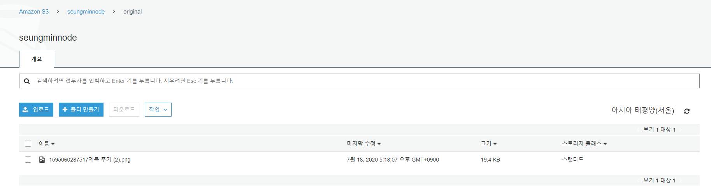

# ✔ 서버리스 노드 개발
## ✌ 서버리스 이해하기
- 서버를 클라우드 서비스가 대신 관리해줘서 개발자나 운영자가 서버를 관리하는 데 드는 부담이 줄어든다.
- 즉, 개발자는 자신의 서비스 로직 작성에만 집중할 수 있게 된다.
- 24시간 작동할 필요가 없는 서버인 경우, 서버리스 컴퓨팅을 사용하면 필요한 경우에만 실행되어 요금을 절약할 수도 있다.
- *AWS* 에서는 *Lambda*나 *API Gateway*, *S3* 등의 서비스가 있다.
- *GCP* 에서는 *App Engine*, *Firebase*, *Cloud Functions*, *Cloud Storage* 등의 서비스가 있다.
- *Lambda*와 *Cloud Functions*는 **특정한 동작을 수행한 로직을 저장하고, 요청이 들어올 때 로직을 실행하는 서비스**이다.
  - 함수처럼 호출할 때 실행되므로 FaaS(*Function as a Service*)라고 불린다.
  - 이미지 리사이징 같이 노드가 하기 버거운 작업을 함수로 만들어 클라우드에 올리고, 리사이징이 필요할 때마다 FaaS 서비스를 호출하면 된다.
- *S3*와 *Cloud Storage*는 **클라우드 데이터 저장소**라고 생각하면 된다.
  - 이미지 같은 데이터를 저장하고, 다른 사람에게 보여줄 수 있다.
  - 노드가 다른 서버에 비해 정적 파일 제공에 딱히 이점이 있지 않으므로 클라우드 데이터 저장소가 대신 정적 파일을 제공하도록 위임하기도 한다.

## ✌️ AWS S3 사용하기
#### AWS S3에 이미지를 업로드 한다.
1. aws.amazon.com 에 로그인 후 서비스 - 스토리지 - S3 클릭
2. 버킷 만들기 또는 시작하기 클릭
3. 버킷 이름(고유하다)과 버킷 리전을 설정한다.
  - 리전은 현재 위치와 가까울수록 이미지 로딩 속도가 빨라진다. 
4. 다음을 계속 누른 후 버킷 만들기 클릭
- S3에서는 허용한 사용자만 버킷 안에 들어 있는 데이터를 가져갈 수 있다.
- 따라서 웹 사이트에서 버킷의 이미지를 로드할 수 있도록 권한을 부여한다.
5. 자신의 버킷을 클릭 후 권한 - 버킷 정책 메뉴를 선택한 뒤, 버킷 정책 편집기에 아래 코드를 적어준다. (JSON 형식으로 버킷 권한을 설정할 수 있다.)
<pre>
{
  "Version": "2012-10-17",
  "Statement": [
    {
      "Sid": "AddPerm",
      "Effect": "Allow",
      "Principal": "*",
      "Action": [
        "s3:GetObject", // S3로부터 데이터를 가져오는 권한
        "s3:PutObject" // S3에 데이터를 넣는 권한
      ],
      "Resource": "arn:aws:s3:::seungminnode/*"
    }
  ]
}
</pre>
#### 노드에서 S3에 접근할 수 있도록 AWS 액세스 키를 발급받는다.
6. 상단 메뉴의 내 계정 이름을 누르고 내 보안 자격 증명 메뉴 클릭
7. 보안 자격 증명의 액세스 키(액세스 키 ID 및 비밀 액세스 키) 선택 후 새 액세스 키 만들기 클릭
8. 보안 액세스 키는 다시 볼 수 없으므로 키 파일 다운로드 버튼 클릭하여 저장한다.
#### 해당 프로젝트로 이동
9. `multer`에서 S3로 업로드할 수 있게 해주는 `multer-s3` 패키지 설치
10. `multer-s3` 패키지는 `aws-sdk` 패키지(AWS의 기능을 노드에서 사용할 수 있게 해주는 패키지)를 필요로 하므로 `aws-sdk`도 같이 설치해준다.
<pre>
$ npm i multer-s3 aws-sdk
</pre>
11. 발급받은 액세스 키 ID와 보안 액세스 키를 `.env` 파일에 복사한다.
<pre>
S3_ACCESS_KEY_ID=[액세스 키 ID]
S3_SECRET_ACCESS_KEY=[보안 액세스 키]
</pre>
#### post 라우터를 수정해준다.
- `AWS.config.update` 메서드로 AWS에 관한 설정을 할 수 있고, 발급받은 액세스 키 ID와 보안 액세스 키, 리전(ap-northeast-2가 서울)을 입력한다.
- `multerS3`의 옵션으로 s3 객체, 버킷명(bucket), 파일명(key)을 입력한다.
- `req.file.location` S3 버킷 이미지 주소가 담겨있다. 이 주소를 클라이언트로 보낸다.
<pre>
const AWS = require('aws-sdk');
const multerS3 = require('multer-s3');
...
// AWS 설정
AWS.config.update({
  accessKeyId: process.env.S3_ACCESS_KEY_ID,
  secretAccessKey: process.env.S3_SECRET_ACCESS_KEY,
  region: 'ap-northeast-2',
})
// AWS 업로드 설정
const upload = multer({
  storage: multerS3({
    s3: new AWS.S3(),
    bucket: 'seungminnode', // 자신의 버킷이름으로 설정
    key(req, file, cb){
      // aws s3의 seungminnode/original/ 에 생성
      cb(null, `original/${Date.now()}${path.basename(file.originalname)}`);
    }
  }),
  limits: { fileSize: 5 * 1024 * 1024 },
});
router.post('/img', isLoggedIn, upload.single('img'), (req, res) => {
  res.json({ url: req.file.location });
});
</pre>
- 서버 실행 후 이미지 업로드

#### 📌 S3를 사용하면 데이터를 저장할 때와 저장된 데이터를 로드할 때 과금이 된다.
- 가입 후 1년간 저장 용량 5GB, 데이터 로드 2만 건, 데이터 업로드 2천 건까지는 무료이다.
- 1년이 지나면 과금이되므로 주의 ❗❗

## ✌ AWS Lambda 사용하기
- S3에 올린 이미지를 리사이징한 후 줄어든 이미지를 다시 S3에 저장한다.
- 사용자가 사이즈가 너무 큰 이미지를 올렸을 경우, 적절한 크기와 용량으로 이미지를 변경하는 것이다.
- 이미지 리사이징은 CPU를 많이 사용하는 작업이여서 Lambda로 분리한다.
1. aws-upload 파일을 따로 생성해준다. (https://github.com/saseungmin/Node.js-tutorial/tree/master/aws-upload)
<pre>
$ npm init
$ npm i aws-sdk gm
</pre>
2. Lambda가 실행할 [`index.js`](https://github.com/saseungmin/Node.js-tutorial/blob/master/aws-upload/index.js) 작성 (주석참고 ❗)
    - gm 패키지는 이미지 조작을 위한 패키지로 `imageMagick` 방식으로 이미지를 리사이징하기 위해 `subClass` 메서드로 설정해준다.
    - gm 패키지의 `resize` 메서드로 크기를 지정하는 데 가로나 세로중 하나가 200px이 될 때까지 이미지를 줄이거나 늘리라는 뜻이다.
    - `*`외에도 기본 옵션이나 `!,>,<,%`와 같은 옵션이 존재한다.
    - 다른 옵션에 대한 설명(https://imagemagick.org/Usage/resize/#resize)
<pre>
// ImageMagick : 이미지 파일을 생성,수정 등의 작업하기 위한 오픈소스 소프트웨어
const gm = require('gm').subClass({ imageMagick: true });
...
    return gm(data.Body)
  .resize(200, 200, '^')
  .quality(90)
  .toBuffer(ext, (err, buffer) => {
    ...
  });
</pre>

3. aws-upload 폴더 아래의 모든 파일을 압축하여 aws-upload.zip 파일로 만든다.
    - 조심해야할 점은 파일을 압축할 때 압축 파일 안에 바로 코드가 들어가야 한다.
4. Lambda 서비스 설정한다. (서비스-컴퓨팅-Lambda 클릭)
5. 함수에 함수 생성 클릭
6. 함수 생성 페이지에서 `새로작성`을 선택하여 기본정보를 작성한다.
    - 함수 이름을 작성하고 런타임은 `Node.js 12.x` 선택한다.
    - `실행 역할을 선택하거나 생성하여`를 클릭하여 `AWS 정책 템플릿에서 새 역할 생성`을 선택한다.
    - `역할 이름`을 입력하고 `정책 템플릿`에서 `Amazon S3 객체 읽기 전용 권한`을 선택한다. (그래야 S3에 업로드된 이미지를 가져올 수 있다.)
7. 함수 생성 버튼 클릭
8. 생성된 Lambda 페이지에서 `함수 코드` 섹션에서 `작업 버튼` 클릭후 aws-upload.zip 파일을 업로드한다.
9. 기본 설정에 핸들러는 반드시 실행할 **파일명.함수명**이어야 한다(`index.handler`)로 설정한다.
10. 트리거 추가 클릭
    - 르리거에 S3 선택
    - 자신의 버킷 버킷 선택 후 이베트 유형을 모든 객체 생성 이벤트 선택
    - **버킷에 파일이 생성되면 함수가 호출된다.**
    - 단, original 폴더 안에 파일만 함수를 트리거하더록 접두사에 `original/`을 적어준다.
    - 설정이 끝나면 추가 버튼을 클릭 후 저장 버튼 클릭한다.