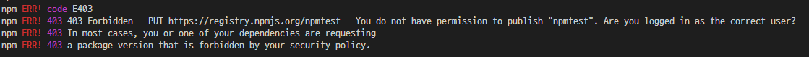
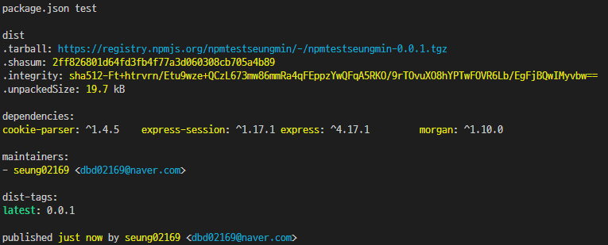
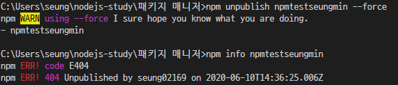

# ✔ 패키지 매니저

- *npm(Node Package Manager)* 는 노드 패키지 매니저로서 노드가 자바스크립트 프로그램을 컴퓨터에서도 실행할 수 있게 해준다.
- *yarn* 은 페이스북이 만든 패키지 매니저
- *package.json* 은 설치한 패키지의 버전을 관리하는 파일이다.

## ✒ 참고 문서
- npm 공식 웹 사이트 : https://www.npmjs.com/
- npm 명령어 설명서 : https://docs.npmjs.com/cli-documentation/
- 패키지 간 비교 사이트 : https://npmcompare.com/
- 패키지 다운로드 추이 확인 : https://www.npmtrends.com/
- 패키지명에 네임스페이스 설정하기 : https://docs.npmjs.com/misc/scope

## ✒ *package.json*으로 패키지 관리 
- 콘솔에 `$ npm init` 입력하여 *package.json* 을 생성한다.

> - package name : 패키지의 이름이다. *package.json*의 name 속성에 저장된다. 
> - version : 패키지의 버전이다.
> - entry point : 자바스크립트 실행 파일 진입점으로 마지막으로 `module.exports`를 하는 파일을 지정하고 *package.json*의 main 속성에 저장된다.
> - test command : 코드를 테스트할 때 입력할 명령어를 의미한다. *package.json*의 scripts 속성 안의 test 속성에 저장된다.
> - git repository : 코드를 저장해둔 Git 저장소 주소를 의미한다. *package.json*의 repository 속성에 저장된다.
> - keywords : 키워드는 npm 공식 홈페이지에서 패키지를 쉽게 찾을 수 있게 해준다. *package.json*의 keywords 속성에 저장된다.
> - license : 해당 패키지의 라이선스를 넣어준다. (ISC, MIT, BSD 라이선스 밝히면 자유 / Apache, GPL)

- 익스프레스(Express) 설치 :  `$ npm install express`
- Express 설치 시 Express가 의존하는 패키지들이 *node_modules*에 생성된다.
<pre>
  "license": "ISC",
  "dependencies": {
    "express": "^4.17.1"
  }
</pre>

- 여러개 동시 설치 : `$npm install morgan cookie-parser express-session`
<pre>
  "dependencies": {
    "cookie-parser": "^1.4.5",
    "express": "^4.17.1",
    "express-session": "^1.17.1",
    "morgan": "^1.10.0"
  }
</pre>

- 개발용 패키지 설치로 실제 배포 시에는 사용되지 않고, 개발 중에만 사용되는 패키지이다. : `$npm install --save-dev nodemon`
- *nodemon*는 소스 코드가 바뀔 때마다 자동으로 노드를 재실해해주는 패키지이다.
<pre>
// 개발용 패키지
  "devDependencies": {
    "nodemon": "^2.0.4"
  }
</pre>

- npm의 전역 설치 옵션으로 패키지를 현재 폴더의 *node-modules*에 설치하는 것이 아니라 npm이 설치되어 있는 폴더에 설치한다.
- 이 폴더의 경로는 시스템 환경 변수에 등록되어 있으므로 전역 설치한 패키지는 콘솔의 커멘드로 사용할 수 있다.
- `$ npm install --global rimraf` : 리눅스나 macOS의 rm-rf 명령어를 윈도우에서도 사용할 수 있게 해준다.

- *rimraf* 로 *node_modules* 삭제 : `$ rimraf node_modules`

#### 🔸 npx 명령어
- 전역 설치한 패키지는 *package.json*에 기록되지 않아 다시 설치할 때 어려움이 있다는 단점이 있다.
<pre>
$ npm install --save-dev rimraf
$ npx rimraf node_modules
</pre>
- *package.json*의 `devDependencies` 속성에 기록한 후, 앞에 `npx` 명령어를 붙여 실행하면 전역 설치한 것과 같은 효과를 얻을 수 있다.

## ✒ 패키지 버전 이해하기
- 노드의 패키지들과 노드의 버전은 항상 세 자리를 이루고 있다.
- 버전이 세 자리인 이유는 SemVer(*Semantic Versioning*, 유의적 버전) 방식의 버전 넘버링을 따르기 때문에 버전을 구성하는 세 자리가 모두 의미를 가지고 있다는 뜻이다.
- <b>버전의 첫 번째 자리</b>는 *major* 버전으로 주 버전이 0이면 초기 개발 중이라는 뜻이고, 1부터는 정식 버전이라는 뜻이다.
- *major* 버전은 하위 호환이 안 될 정도로 패키지의 내용이 수정되었을 때 올린다. (1.5.0 ➡ 2.0.0)
- <b>버전의 두번째 자리</b>는 *minor* 버전으로 하위 호환이 되는 기능 업데이트 시에 올린다. (1.5.0 ➡ 1.6.0)
- <b>버전의 세번째 자리</b>는 *patch* 버전으로 기존 기능에 문제가 있어 수정한 것을 내놓았을 때 *patch*버전을 올린다. (1.5.0 ➡ 1.5.1)
- 📌 *package.json*에는 ^나 ~ 또는 > , < 같은 문자가 붙어 있다.
  - ^ 기호는 *minor* 버전까지만 설치 또는 업데이트를 한다. 예를 들어, `npm i express@^1.1.1` 이라면 1.1.1 에서부터 2.0.0 전 버전까지 설치된다.
  - ~ 기호는 *patch* 버전까지만 설치 또는 업데이트한다.예를 들어, `npm i express@^1.1.1` 이라면 1.1.1 에서부터 1.2.0 전 버전까지 설치된다.
  -  `>, <, >=, <=, = `는 초과, 미만, 이상, 이하, 동일을 뜻하는 것으로 `npm i express@>1.1.1`이라면 반드시 1.1.1 버전보다 높은 버전이 설치된다.
  - `@latest`는 항상 최신 버전의 패키지를 설치하고 `x`로도 표현가능하다. `npm i express@latest`또는 `npm i express@x`

## ✒ 기타 npm 명령어
1. `npm outdated` : 업데이트할 수 있는 패키지가 있는지 확인할 수 있다.
2. `npm update 패키지명` :  업데이트할 수 있다.
3. `npm uninstall 패키지명` : 패키지를 제거할 수 있다. 패키지가 *node_modules*폴더와 *package.json*에서 사라진다. (`npm rm 패키지명`)
4. `npm search 검색어` : npm의 패키지를 검색할 수 있다.
5. `npm info 패키지명` : 패키지의 세부 정보를 파악하고자 할 때 사용하는 명령어로 *package.json*의 내용과 의존 관계, 설치 가능한 버전 정보 등이 표시된다.
6. `npm adduser` : npm 로그인을 위한 명령어로 npm 공식 사이트에서 가입한 계정으로 로그인하면 된다.
7. `npm whoami` : 로그인한 사용자가 누구인지 알려주고 로그인된 상태가 아니면 에러가 발생한다.
8. `npm logout` : 로그인한 계정을 로그아웃한다.
9. `npm version 버전` : *package.json*의 버전을 올려주고 원하는 버전의 숫자를 넣으면 된다.
10. `npm deprecate [패키지명][버전] [메시지]` : 해당 패키지를 설치할 떄 경고 메시지를 띄우게 하는 명령어로 자신의 패키지에만 명령어를 적용할 수 있따.
11. `npm publish` : 자신이 만든 패키지를 배포할 때 사용한다.
12. `npm unpublish` : 배포한 패키지를 제거할 때 사용하고 24시간 이내에 배포한 패키지만 제거할 수 있다. (다른 사람이 사용하고 있는 패키지를 제거하는 경우를 막기 위해서)
#### 📌 이외 명령어 npm 공식 문서 : https://docs.npmjs.com/cli-documentation/

## ✒ 패키지 배포하기
1. [npm](https://www.npmjs.com/) 공식 사이트에서 회원가입
2. 콘솔에서 `npm adduser` 명령어를 입력하여 생성 계정으로 로그인
3. `npm publish` 명령어로 패키지를 배포하지만 동일한 이름으로 사용시 에러가 발생한다.

4. `npm info [패키지명]`을 콘솔에 입력후 해당 패키지에 대한 정보가 나오면 누군가가 사용하기 때문에 변경해주어야 한다.
5. *package.json*에서 원하는 이름으로 name을 바꾸고, 다시 `npm publish` 명령어를 입력한다.
6. 제대로 npm에 등록되어있나 확인한다. `npm info [패키지명]`

7. `npm unpublish [패키지명] --force` 명령어로 24시간이내에 삭제해야한다. 삭제후 확인

