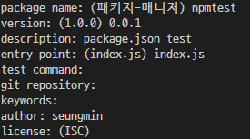
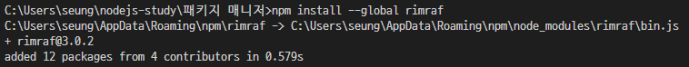

# ✔ 패키지 매니저
- *npm(Node Package Manager)* 는 노드 패키지 매니저로서 노드가 자바스크립트 프로그램을 컴퓨터에서도 실행할 수 있게 해준다.
- *yarn* 은 페이스북이 만든 패키지 매니저
- *package.json* 은 설치한 패키지의 버전을 관리하는 파일이다.

## ✒ *package.json*으로 패키지 관리 
- 콘솔에 `$ npm init` 입력하여 *package.json* 을 생성한다.

> - package name : 패키지의 이름이다. *package.json*의 name 속성에 저장된다. 
> - version : 패키지의 버전이다.
> - entry point : 자바스크립트 실행 파일 진입점으로 마지막으로 `module.exports`를 하는 파일을 지정하고 *package.json*의 main 속성에 저장된다.
> - test command : 코드를 테스트할 때 입력할 명령어를 의미한다. *package.json*의 scripts 속성 안의 test 속성에 저장된다.
> - git repository : 코드를 저장해둔 Git 저장소 주소를 의미한다. *package.json*의 repository 속성에 저장된다.
> - keywords : 키워드는 npm 공식 홈페이지에서 패키지를 쉽게 찾을 수 있게 해준다. *package.json*의 keywords 속성에 저장된다.
> - license : 해당 패키지의 라이선스를 넣어준다. (ISC, MIT, BSD 라이선스 밝히면 자유 / Apache, GPL)

- 익스프레스(Express) 설치 :  `$ npm install express`
- Express 설치 시 Express가 의존하는 패키지들이 *node_modules*에 생성된다.
<pre>
  "license": "ISC",
  "dependencies": {
    "express": "^4.17.1"
  }
</pre>

- 여러개 동시 설치 : `$npm install morgan cookie-parser express-session`
<pre>
  "dependencies": {
    "cookie-parser": "^1.4.5",
    "express": "^4.17.1",
    "express-session": "^1.17.1",
    "morgan": "^1.10.0"
  }
</pre>

- 개발용 패키지 설치로 실제 배포 시에는 사용되지 않고, 개발 중에만 사용되는 패키지이다. : `$npm install --save-dev nodemon`
- *nodemon*는 소스 코드가 바뀔 때마다 자동으로 노드를 재실해해주는 패키지이다.
<pre>
// 개발용 패키지
  "devDependencies": {
    "nodemon": "^2.0.4"
  }
</pre>

- npm의 전역 설치 옵션으로 패키지를 현재 폴더의 *node-modules*에 설치하는 것이 아니라 npm이 설치되어 있는 폴더에 설치한다.
- 이 폴더의 경로는 시스템 환경 변수에 등록되어 있으므로 전역 설치한 패키지는 콘솔의 커멘드로 사용할 수 있다.
- `$ npm install --global rimraf` : 리눅스나 macOS의 rm-rf 명령어를 윈도우에서도 사용할 수 있게 해준다.

- *rimraf* 로 *node_modules* 삭제 : `$ rimraf node_modules`

#### 🔸 npx 명령어
- 전역 설치한 패키지는 *package.json*에 기록되지 않아 다시 설치할 때 어려움이 있다는 단점이 있다.
<pre>
$ npm install --save-dev rimraf
$ npx rimraf node_modules
</pre>
- *package.json*의 `devDependencies` 속성에 기록한 후, 앞에 `npx` 명령어를 붙여 실행하면 전역 설치한 것과 같은 효과를 얻을 수 있다.

